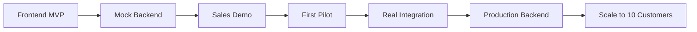

# Antevus Implementation Roadmap
## Ship Fast, Generate Revenue Early

### Strategic Approach
**Goal**: Get to first paying pilot customer in 6-8 weeks  
**Strategy**: Frontend-first demo → Mock backend → One real integration → Scale

---

## Phase 0: Foundation & Setup (Week 1) ✅ COMPLETED
*Get the basics right before building*

### Project Infrastructure
- [x] Initialize Next.js 14 app with TypeScript
- [x] Set up Tailwind CSS + Radix UI components
- [x] Configure ESLint, Prettier, Husky pre-commit hooks
- [x] Set up Vercel deployment pipeline
- [x] Initialize GitHub Actions CI/CD
- [x] Set up Sentry error tracking
- [x] Configure PostHog analytics

### Development Environment
- [x] Create docker-compose for local development
- [x] Set up environment variables structure
- [ ] Configure development, staging, production environments
- [ ] Set up feature flags system (LaunchDarkly or custom)

**Completion Date**: December 11, 2024
**Status**: Foundation ready, app running at `http://localhost:3000`

---

## Phase 1: Demo-Ready Frontend MVP (Weeks 2-3)
*Build what sells - a compelling visual story*

### Core Dashboard Pages

#### 1. Landing/Login Page
- [ ] Clean, professional login with OAuth mock
- [ ] "Request Demo" prominent CTA
- [ ] Social proof section (partner logos placeholder)

#### 2. Instruments Dashboard (THE MONEY SHOT)
- [ ] Grid view with 6-8 mock instruments
- [ ] Real-time status indicators (Running/Idle/Error)
- [ ] Animated status transitions
- [ ] Click for instrument details panel
- [ ] Search and filter capabilities
- [ ] Mock data: Mix of Illumina, Tecan, Hamilton devices

#### 3. Run History & Data View
- [ ] Searchable table of completed runs
- [ ] Data preview modal with charts
- [ ] Export buttons (CSV, JSON, PDF)
- [ ] Filter by date, instrument, status
- [ ] Pagination with 100+ mock entries

#### 4. Real-Time Monitoring
- [ ] Live-updating line charts (mock data stream)
- [ ] QC threshold indicators
- [ ] Temperature, pressure, progress metrics
- [ ] WebSocket connection indicator

#### 5. Integrations Hub
- [ ] Grid of integration cards (Benchling, Slack, Teams, etc.)
- [ ] One-click "Connect" buttons
- [ ] Configuration modals
- [ ] Status indicators for each integration

#### 6. API Playground
- [ ] Interactive API documentation (Stripe-style)
- [ ] Live request/response preview
- [ ] Code examples in Python, JavaScript, cURL
- [ ] API key generation interface

### Frontend Technical Stack
```
next.js 14 (app router)
├── /app
│   ├── (auth)
│   │   ├── login/
│   │   └── signup/
│   ├── (dashboard)
│   │   ├── instruments/
│   │   ├── runs/
│   │   ├── monitoring/
│   │   ├── integrations/
│   │   └── api-playground/
│   └── api/
│       └── mock/
├── /components
│   ├── ui/           (Radix primitives)
│   ├── charts/       (Recharts components)
│   └── layouts/
├── /lib
│   ├── mock-data/
│   └── utils/
└── /public
```

---

## Phase 2: Mock Backend & API (Week 4)
*Make the demo interactive and believable*

### Mock API Implementation
- [ ] Next.js API routes for all endpoints
- [ ] Realistic response delays (simulate network)
- [ ] Mock authentication flow
- [ ] Session management
- [ ] Rate limiting simulation

### Core Mock Endpoints
```typescript
GET  /api/instruments      // Returns mock instrument list
GET  /api/instruments/:id  // Instrument details
GET  /api/runs            // Paginated run history
GET  /api/runs/:id        // Run details with data
POST /api/webhooks        // Register webhook (mock)
GET  /api/stream/:id      // SSE for real-time data
```

### Mock Data Generation
- [ ] Realistic instrument names and models
- [ ] Time-series data for charts
- [ ] Error states and edge cases
- [ ] CSV/JSON export functionality
- [ ] WebSocket mock events

---

## Phase 3: Sales & Marketing Assets (Week 5)
*Tools to close deals*

### Sales Enablement
- [ ] Interactive demo environment (demo.antevus.io)
- [ ] Customizable demo data per prospect
- [ ] Screen recording of key workflows
- [ ] ROI calculator component
- [ ] Comparison matrix vs manual process

### Documentation Site
- [ ] Docusaurus or Mintlify setup
- [ ] Getting Started guide
- [ ] API reference
- [ ] SDK documentation (even if not built yet)
- [ ] Architecture diagrams

### Lead Capture
- [ ] HubSpot integration
- [ ] "Book Demo" Calendly embed
- [ ] Newsletter signup
- [ ] Pilot program application form

---

## Phase 4: First Real Integration (Weeks 6-7)
*Prove it works with ONE device*

### Target: Opentrons OT-2 (Most Developer-Friendly)
- [ ] Python agent prototype
- [ ] Serial/USB communication
- [ ] Parse Opentrons JSON protocol
- [ ] Stream real-time data
- [ ] Error handling

### Minimal Backend Infrastructure
- [ ] FastAPI application
- [ ] PostgreSQL + TimescaleDB
- [ ] Basic authentication
- [ ] Single tenant setup
- [ ] Heroku/Railway deployment

### Data Pipeline
- [ ] Instrument → Agent → API → Database
- [ ] Basic normalization schema
- [ ] CSV/JSON export
- [ ] Webhook notifications

---

## Phase 5: Pilot Customer Onboarding (Week 8)
*Get paying customer #1*

### Customer Success Infrastructure
- [ ] Onboarding checklist app
- [ ] Slack shared channel setup
- [ ] Support ticket system (Intercom)
- [ ] Status page (status.antevus.io)
- [ ] Usage analytics dashboard

### Pilot Package Features
- [ ] 3 instruments connected
- [ ] 10GB data storage
- [ ] Email/Slack notifications
- [ ] CSV exports
- [ ] 30-day money back guarantee

### Pricing Strategy
- [ ] $500/month per instrument
- [ ] 3-month pilot minimum
- [ ] 50% discount for testimonial/case study

---

## Phase 6: Scale Core Platform (Weeks 9-16)
*Build the real thing once revenue is proven*

### Production Backend
- [ ] Kubernetes cluster setup (EKS)
- [ ] Multi-tenant architecture
- [ ] Kafka event streaming
- [ ] Redis caching layer
- [ ] S3 data lake

### Additional Instrument Connectors
Priority order based on market demand:
1. [ ] Illumina sequencers (high value)
2. [ ] Tecan liquid handlers (common)
3. [ ] Agilent HPLC/Mass Spec (pharma)
4. [ ] Hamilton STAR (biotech)
5. [ ] Thermo Fisher equipment

### Security & Compliance
- [ ] Auth0 implementation
- [ ] SOC 2 audit preparation
- [ ] Penetration testing
- [ ] HIPAA compliance assessment
- [ ] Audit logging system

### Developer Experience
- [ ] Python SDK (`pip install antevus`)
- [ ] JavaScript/TypeScript SDK
- [ ] Postman collection
- [ ] OpenAPI specification
- [ ] Webhook debugging tools

---

## Phase 7: Advanced Features (Months 4-6)
*Differentiate and defend*

### Enterprise Features
- [ ] SSO/SAML integration
- [ ] Advanced RBAC
- [ ] Custom data retention policies
- [ ] White-label options
- [ ] SLA monitoring

### AI/ML Capabilities
- [ ] Anomaly detection
- [ ] Predictive maintenance
- [ ] Run optimization suggestions
- [ ] Natural language queries
- [ ] Auto-generated reports

### Marketplace
- [ ] Integration templates
- [ ] Community connectors
- [ ] Workflow sharing
- [ ] Partner app store

---

## Critical Path Dependencies



---

## Resource Requirements

### Immediate Needs (Weeks 1-8)
- **Engineering**: 1-2 full-stack developers
- **Design**: 1 part-time UI/UX designer
- **Sales**: Founder-led sales
- **Cost**: ~$5-10K (infrastructure + tools)

### Scaling Needs (Months 3-6)
- **Engineering**: 3-4 developers (frontend, backend, integrations)
- **DevOps**: 1 dedicated
- **Sales**: 1 dedicated AE
- **Customer Success**: 1 CSM
- **Cost**: ~$30-50K/month

---

## Risk Mitigation

### Technical Risks
- **Risk**: Instrument protocols are proprietary
- **Mitigation**: Partner with instrument vendors, reverse engineer published protocols

### Market Risks
- **Risk**: Labs slow to adopt
- **Mitigation**: Start with innovation labs, biotechs, not big pharma

### Competition Risks
- **Risk**: Benchling or LabVantage adds similar features
- **Mitigation**: Move fast, focus on developer experience, open-source some components

---

## Success Metrics by Phase

### Phase 1-3 (Demo)
- [ ] 10+ demo requests
- [ ] 5+ qualified leads
- [ ] 1 design partner committed

### Phase 4-5 (Pilot)
- [ ] 1 paying pilot customer
- [ ] $1,500+ MRR
- [ ] <1 week onboarding time

### Phase 6-7 (Scale)
- [ ] 10 paying customers
- [ ] $50K+ MRR
- [ ] 2+ instrument types in production
- [ ] <1 day integration time for new devices

---

## Quick Wins for Week 1

1. **Deploy "Coming Soon" page** with email capture
2. **Create Figma mockups** of dashboard
3. **Build instrument status grid** component
4. **Set up GitHub repo** with proper README
5. **Launch ProductHunt** teaser
6. **Reach out to 10 labs** for problem validation

---

## Development Velocity Targets

- **Daily**: 2-3 meaningful commits
- **Weekly**: 1 major feature shipped
- **Bi-weekly**: Customer demo
- **Monthly**: New pilot customer

---

## Go-to-Market While Building

### Content Marketing
- [ ] "Building Antevus in Public" blog series
- [ ] YouTube demos of integrations
- [ ] Developer tutorials
- [ ] Lab automation podcast appearances

### Community Building
- [ ] Discord for beta users
- [ ] GitHub discussions
- [ ] Monthly virtual meetups
- [ ] Lab automation Slack community

### Partnership Development
- [ ] Opentrons developer program
- [ ] Benchling marketplace
- [ ] AWS Activate
- [ ] Y Combinator application

---

## The Path to $1M ARR

```
Month 1: Demo + 1 pilot ($1.5K MRR)
Month 2: 3 pilots ($4.5K MRR)
Month 3: 10 customers ($15K MRR)
Month 4: 25 customers ($37K MRR)
Month 5: 40 customers ($60K MRR)
Month 6: 55 customers ($83K MRR)
```

**Key Assumptions**:
- Average $1,500/month per customer
- 3 instruments per customer
- 50% month-over-month growth
- 10% churn rate

---

## Next Steps

### This Week
1. Set up Next.js project with TypeScript
2. Design instrument dashboard in Figma
3. Build first React components
4. Deploy to Vercel
5. Share demo link with 5 potential customers

### This Month
1. Complete Phase 1-3
2. Get 3 design partners
3. Close first pilot
4. Raise pre-seed round ($500K-$1M)

### This Quarter
1. 10 paying customers
2. 3 instrument types integrated
3. $50K MRR
4. Seed round conversations

---

## Remember: Speed > Perfection

- Ship daily
- Get customer feedback weekly
- Iterate based on usage, not assumptions
- Sell the vision, build the MVP
- Revenue validates everything

**The goal is not to build the perfect platform. The goal is to prove labs will pay for unified instrument connectivity, then scale.**