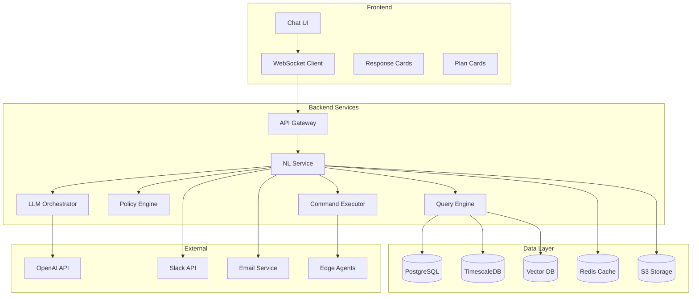

# Natural Language Lab Assistant - Implementation Plan

## Executive Summary
**STATUS: Frontend Complete, Backend In Progress (December 17, 2024)**

This document outlines the comprehensive implementation of the Natural Language Lab Assistant feature in Antevus - a conversational AI interface that enables scientists to control laboratory instruments, query data, and generate reports using natural language commands.

## Current Implementation Status

### ✅ Completed (Frontend & Security)
- ✅ Full chat interface with streaming UI simulation
- ✅ Thread management system (create, rename, delete, search)
- ✅ Encrypted conversation storage with audit logging
- ✅ Smart suggested prompts
- ✅ Mobile-responsive design
- ✅ Production-ready state management
- ✅ Security infrastructure (auth, XSS protection, data classification)
- ✅ HIPAA-compliant session storage

### 🚧 In Progress (Backend Infrastructure)
- ⏳ LLM integration (OpenAI/Claude)
- ⏳ Real-time streaming via SSE/WebSockets
- ⏳ Function calling for instrument control
- ⏳ Policy engine for command validation
- ⏳ Vector database for semantic search
- ⏳ Report generation system
- ⏳ Notification services

## Table of Contents
1. [Project Overview](#project-overview)
2. [Implementation Phases](#implementation-phases)
3. [Technical Architecture](#technical-architecture)
4. [Development Tasks](#development-tasks)
5. [Integration Points](#integration-points)
6. [Security & Compliance](#security-compliance)
7. [Testing Strategy](#testing-strategy)
8. [Deployment Plan](#deployment-plan)
9. [Success Metrics](#success-metrics)
10. [Risk Mitigation](#risk-mitigation)

## Project Overview

### Goal
Build a chat-based natural language interface that allows lab personnel to:
- Query instrument status and run history
- Control instruments with policy-enforced safety
- Generate reports and summaries
- Collaborate via integrated notifications

### Timeline
- **Duration**: 8-10 weeks
- **Team Size**: 3-4 engineers (Frontend, Backend, AI/ML, DevOps)
- **Sprint Length**: 2 weeks

### Key Deliverables
1. Chat interface with streaming responses
2. LLM integration with function calling
3. Policy engine for safe command execution
4. Audit trail system for compliance
5. Integration with existing Antevus infrastructure

## Implementation Phases

### Phase 1: Foundation ✅ COMPLETE
**Goal**: Set up core infrastructure and basic chat interface

#### Backend Tasks
- [x] Design database schema for chat sessions and audit logs
- [x] Create thread storage API with encryption
- [x] Implement audit logging system
- [x] Set up data classification service

#### Frontend Tasks
- [x] Create chat panel component with Tailwind CSS
- [x] Implement message streaming UI with markdown support
- [x] Build typing indicators and loading states
- [x] Add collapsible/expandable chat interface
- [x] Create basic message history display

#### Security Tasks
- [x] Implement XSS protection
- [x] Add RBAC authorization
- [x] Create secure session storage
- [x] Build audit logging infrastructure

### Phase 2: Backend Core Infrastructure 🚧 IN PROGRESS (Week 1-2 from now)
**Goal**: Build essential backend services for real LLM integration

#### LLM Integration Tasks
- [ ] Set up OpenAI API integration with GPT-4o
- [ ] Implement streaming response handler
- [ ] Create token usage tracking and monitoring
- [ ] Build error handling and fallback mechanisms
- [ ] Add provider abstraction layer for multi-LLM support

#### API Development Tasks
- [ ] Create `/api/chat/completion` endpoint for message processing
- [ ] Implement `/api/chat/stream` for Server-Sent Events
- [ ] Build context window management system
- [ ] Add message validation and sanitization pipeline
- [ ] Implement conversation memory management

#### Real-time Communication Tasks
- [ ] Set up Server-Sent Events infrastructure
- [ ] Implement WebSocket fallback option
- [ ] Build connection management and heartbeat
- [ ] Create reconnection logic with backoff
- [ ] Add stream chunking and buffering

### Phase 3: Function Calling & Data Integration (Week 2-3 from now)
**Goal**: Enable instrument queries and control through function calling

#### Tool Registry Development
- [ ] Create tool registry system with typed schemas
- [ ] Implement function calling interface for OpenAI
- [ ] Build parameter validation and type checking
- [ ] Add permission-based tool filtering
- [ ] Create tool documentation generator

#### Instrument Integration Tasks
- [ ] Implement `getInstrumentStatus()` function
- [ ] Build `getRunHistory()` with filters
- [ ] Create `startRun()` with validation
- [ ] Add `stopRun()` with safety checks
- [ ] Implement `getProtocols()` listing

#### Query Engine Development
- [ ] Build natural language to SQL converter
- [ ] Integrate with TimescaleDB for metrics
- [ ] Create result formatting system
- [ ] Add pagination and filtering
- [ ] Implement data aggregation functions

### Phase 4: Safety & Compliance Layer (Week 3-4 from now)
**Goal**: Add safety guardrails and compliance features

#### Policy Engine Development
- [ ] Build Open Policy Agent integration
- [ ] Create command validation rules
- [ ] Implement dry-run preview system
- [ ] Add risk assessment scoring
- [ ] Build audit trail for all actions

#### Intent Classification System
- [ ] Create intent parser with confidence scores
- [ ] Build action classification model
- [ ] Implement confirmation requirements
- [ ] Add multi-step approval workflows
- [ ] Create rollback mechanisms

#### Compliance Features
- [ ] Implement e-signature capture
- [ ] Build 21 CFR Part 11 compliance logs
- [ ] Create immutable audit records
- [ ] Add data retention policies
- [ ] Implement access control matrix

### Phase 5: Advanced Features (Week 4-5 from now)
**Goal**: Enhanced capabilities and integrations

#### Vector Search & RAG
- [ ] Set up pgvector for embeddings
- [ ] Implement document chunking system
- [ ] Build semantic search pipeline
- [ ] Create context retrieval system
- [ ] Add relevance scoring

#### Report Generation
- [ ] Build PDF generation service
- [ ] Create CSV export functionality
- [ ] Implement template system
- [ ] Add scheduled reports
- [ ] Build report distribution

#### Notification Services
- [ ] Implement Slack webhook integration
- [ ] Add email notification system
- [ ] Create real-time alerts
- [ ] Build notification preferences
- [ ] Add delivery tracking

### Phase 6: Production Readiness (Week 5-6 from now)
**Goal**: Testing, optimization, and deployment preparation

#### Performance Optimization
- [ ] Implement response caching strategy
- [ ] Add database query optimization
- [ ] Reduce LLM token usage
- [ ] Optimize streaming latency
- [ ] Add CDN for static assets

#### Testing Suite
- [ ] Unit tests (>80% coverage)
- [ ] Integration tests for all APIs
- [ ] E2E tests for critical paths
- [ ] Load testing with k6/JMeter
- [ ] Security penetration testing

#### Monitoring & Observability
- [ ] Set up Prometheus metrics
- [ ] Add Grafana dashboards
- [ ] Implement distributed tracing
- [ ] Create alert rules
- [ ] Build performance monitoring

## Backend Implementation Details

### Current Architecture Decisions

#### LLM Provider Strategy
```typescript
// Provider abstraction for multi-LLM support
interface LLMProvider {
  complete(messages: Message[]): AsyncGenerator<string>
  embed(text: string): Promise<number[]>
  functionCall(messages: Message[], tools: Tool[]): Promise<FunctionCall>
}

// Implementations
class OpenAIProvider implements LLMProvider {
  model = 'gpt-4o'
  // OpenAI-specific implementation
}

class ClaudeProvider implements LLMProvider {
  model = 'claude-3-opus'
  // Anthropic-specific implementation
}
```

#### Streaming Architecture
```typescript
// Server-Sent Events for broad compatibility
export async function POST(req: Request) {
  const encoder = new TextEncoder()
  const stream = new TransformStream()
  const writer = stream.writable.getWriter()

  // Stream LLM responses
  const llmStream = await openai.chat.completions.create({
    model: 'gpt-4o',
    messages,
    stream: true,
    tools: functionDefinitions
  })

  for await (const chunk of llmStream) {
    const data = `data: ${JSON.stringify(chunk)}\n\n`
    await writer.write(encoder.encode(data))
  }

  return new Response(stream.readable, {
    headers: {
      'Content-Type': 'text/event-stream',
      'Cache-Control': 'no-cache',
      'Connection': 'keep-alive'
    }
  })
}
```

#### Function Calling Schema
```typescript
// Tool definition for OpenAI function calling
const instrumentTools = [
  {
    type: 'function',
    function: {
      name: 'get_instrument_status',
      description: 'Get status of lab instruments',
      parameters: {
        type: 'object',
        properties: {
          instrumentId: { type: 'string' },
          includeHistory: { type: 'boolean' }
        }
      }
    }
  },
  // Additional tools...
]
```

#### Security Implementation
```typescript
// Maintain existing security patterns
- Encrypted storage for sensitive data
- Comprehensive audit logging
- Input validation and sanitization
- Rate limiting per user/API key
- Session-based authentication
- RBAC with granular permissions
```

## Technical Architecture

### System Components



### Technology Stack

#### Backend
```yaml
Core:
  - Language: Python 3.11+
  - Framework: FastAPI
  - Async: asyncio + aiohttp

LLM:
  - Primary: OpenAI GPT-4o with function calling
  - Fallback: Claude 3.5 Sonnet
  - Embeddings: OpenAI text-embedding-3-small

Databases:
  - PostgreSQL 15 with pgvector
  - TimescaleDB for metrics
  - Redis for caching

Security:
  - OPA for policy engine
  - JWT for authentication
  - TLS 1.3 for transport
```

#### Frontend
```yaml
Core:
  - Framework: Next.js 14
  - Language: TypeScript
  - Styling: Tailwind CSS v3

Components:
  - UI Library: Radix UI
  - Charts: Recharts
  - Markdown: react-markdown
  - WebSocket: socket.io-client

State:
  - React Query for API
  - Zustand for chat state
  - Context for auth
```

### API Endpoints

```typescript
// Natural Language Endpoints
interface NLEndpoints {
  // WebSocket for streaming chat
  WS: '/api/lab-assistant/chat'

  // REST endpoints
  POST: {
    '/api/lab-assistant/intent': IntentRequest => IntentResponse
    '/api/lab-assistant/execute': ExecuteRequest => ExecuteResponse
    '/api/lab-assistant/feedback': FeedbackRequest => void
  }

  GET: {
    '/api/lab-assistant/capabilities': void => Capability[]
    '/api/lab-assistant/history': HistoryParams => Message[]
    '/api/lab-assistant/templates': void => Template[]
  }
}

// Function Calling Schema
interface ToolFunctions {
  get_status: (site?: string, project?: string) => InstrumentStatus[]
  get_runs: (filter: RunFilter) => Run[]
  start_run: (params: RunParams) => RunResult
  stop_run: (runId: string) => StopResult
  summarize_runs: (dateRange: DateRange) => Summary
  export_report: (format: Format, destination: Destination) => ExportResult
}
```

## Development Tasks

### Sprint 1 (Weeks 1-2)
```markdown
Backend:
- [ ] Set up NL service repository and CI/CD
- [ ] Implement basic LLM integration
- [ ] Create WebSocket handler
- [ ] Design database schema
- [ ] Build prompt management system

Frontend:
- [ ] Create chat component structure
- [ ] Implement message streaming
- [ ] Build responsive layout
- [ ] Add dark mode support
- [ ] Create loading states

DevOps:
- [ ] Configure Docker containers
- [ ] Set up Kubernetes manifests
- [ ] Implement secrets management
- [ ] Configure monitoring
```

### Sprint 2 (Weeks 3-4)
```markdown
Backend:
- [ ] Implement function calling
- [ ] Build query engine
- [ ] Create embedding pipeline
- [ ] Develop context management
- [ ] Add response formatting

Frontend:
- [ ] Build rich response cards
- [ ] Implement data tables
- [ ] Add chart components
- [ ] Create export functionality
- [ ] Build error handling

Testing:
- [ ] Unit tests for query engine
- [ ] Integration tests for LLM
- [ ] Frontend component tests
```

### Sprint 3 (Weeks 5-6)
```markdown
Backend:
- [ ] Build intent parser
- [ ] Implement policy engine
- [ ] Create command executor
- [ ] Add audit logging
- [ ] Build rollback system

Frontend:
- [ ] Create confirmation dialogs
- [ ] Build plan cards
- [ ] Implement e-signature
- [ ] Add progress tracking
- [ ] Create abort mechanism

Security:
- [ ] Integrate OPA
- [ ] Implement RBAC
- [ ] Add command validation
- [ ] Create compliance reports
```

### Sprint 4 (Weeks 7-8)
```markdown
Backend:
- [ ] Build report generator
- [ ] Implement integrations
- [ ] Create workflow engine
- [ ] Add template system
- [ ] Implement scheduling

Frontend:
- [ ] Create report preview
- [ ] Build settings UI
- [ ] Add workflow builder
- [ ] Implement templates
- [ ] Create sharing features

Integration:
- [ ] Connect Slack/Teams
- [ ] Integrate email
- [ ] Link to storage
- [ ] Connect ELN/LIMS
```

### Sprint 5 (Weeks 9-10)
```markdown
Testing:
- [ ] Complete unit tests
- [ ] Run integration tests
- [ ] Perform E2E testing
- [ ] Execute load testing
- [ ] Conduct security audit

Optimization:
- [ ] Implement caching
- [ ] Optimize queries
- [ ] Reduce token usage
- [ ] Improve latency
- [ ] Enhance UX

Documentation:
- [ ] API documentation
- [ ] User guides
- [ ] Admin manual
- [ ] Security guidelines
```

## Integration Points

### Existing Antevus Services
```yaml
Instrument Service:
  - GET /api/instruments
  - GET /api/instruments/{id}/status
  - POST /api/instruments/{id}/commands

Run Service:
  - GET /api/runs
  - GET /api/runs/{id}
  - GET /api/runs/{id}/data
  - POST /api/runs/start

Protocol Service:
  - GET /api/protocols
  - GET /api/protocols/{id}
  - POST /api/protocols/validate

User Service:
  - GET /api/users/current
  - GET /api/users/permissions
  - POST /api/users/signature
```

### External Integrations
```yaml
Slack:
  - Webhook URL for notifications
  - OAuth for slash commands
  - Block kit for rich messages

Teams:
  - Incoming webhook connector
  - Adaptive cards for rich content
  - Bot framework for interactions

Email:
  - SendGrid/AWS SES for delivery
  - HTML templates for reports
  - Attachment support for exports

ELN/LIMS:
  - REST APIs for data push
  - OAuth for authentication
  - Webhook for updates
```

## Security & Compliance

### Security Requirements

#### Authentication & Authorization
```yaml
Authentication:
  - SSO via SAML/OIDC
  - MFA enforcement
  - Session management
  - API key rotation

Authorization:
  - Role-based access (RBAC)
  - Attribute-based access (ABAC)
  - Project-level permissions
  - Instrument-specific controls
```

#### Data Protection
```yaml
Encryption:
  - TLS 1.3 in transit
  - AES-256 at rest
  - Key rotation policy
  - Secure key storage

Privacy:
  - PII redaction in logs
  - GDPR compliance
  - Data retention policies
  - Right to deletion
```

### Compliance Features

#### 21 CFR Part 11
```yaml
Electronic Records:
  - Immutable audit trail
  - Version control
  - Backup and recovery
  - Data integrity checks

Electronic Signatures:
  - User authentication
  - Signature binding
  - Non-repudiation
  - Timestamp accuracy
```

#### Audit Trail
```yaml
Logging:
  - User actions
  - System events
  - Data changes
  - Access attempts

Storage:
  - WORM compliance
  - Tamper-proof
  - Searchable
  - Exportable
```

## Testing Strategy

### Test Coverage Requirements
```yaml
Unit Tests: >80% coverage
Integration Tests: All API endpoints
E2E Tests: Critical user paths
Performance Tests: <3s P95 latency
Security Tests: OWASP Top 10
```

### Test Scenarios

#### Functional Tests
```markdown
1. Query Tests
   - Simple status queries
   - Complex filter queries
   - Historical data queries
   - Invalid query handling

2. Control Tests
   - Valid command execution
   - Permission denial
   - Confirmation flow
   - Rollback scenarios

3. Report Tests
   - Report generation
   - Export formats
   - Scheduling
   - Delivery methods
```

#### Non-Functional Tests
```markdown
1. Performance
   - Response time under load
   - Concurrent user handling
   - Token optimization
   - Database query performance

2. Security
   - SQL injection prevention
   - Command injection prevention
   - Authorization bypass attempts
   - Rate limiting effectiveness

3. Reliability
   - Network failure recovery
   - LLM API failures
   - Database connection issues
   - Message queue failures
```

## Deployment Plan

### Environment Strategy
```yaml
Development:
  - Local Docker Compose
  - Mock LLM responses
  - Test data fixtures
  - Hot reload enabled

Staging:
  - Kubernetes cluster
  - Real LLM integration
  - Production-like data
  - Performance monitoring

Production:
  - Multi-region deployment
  - Auto-scaling enabled
  - Full monitoring suite
  - Disaster recovery ready
```

### Rollout Strategy

#### Phase 1: Internal Beta
- **Duration**: 1 week
- **Users**: Internal team only
- **Focus**: Basic functionality validation

#### Phase 2: Limited Beta
- **Duration**: 2 weeks
- **Users**: 5-10 selected customers
- **Focus**: Real-world usage patterns

#### Phase 3: General Availability
- **Duration**: Ongoing
- **Users**: All customers
- **Focus**: Scale and optimization

### Monitoring & Observability
```yaml
Metrics:
  - Response time percentiles
  - Token usage per request
  - Error rates by type
  - User engagement metrics

Logs:
  - Application logs (JSON)
  - Access logs
  - Audit logs
  - LLM interaction logs

Traces:
  - Distributed tracing
  - Request flow visualization
  - Performance bottlenecks
  - Error propagation

Alerts:
  - High error rates
  - Slow response times
  - Failed authentications
  - Policy violations
```

## Success Metrics

### Business Metrics
```yaml
Adoption:
  - Target: 50% DAU engagement in 30 days
  - Measurement: Unique users per day

Usage:
  - Target: 100+ commands per day per lab
  - Measurement: Total commands executed

Efficiency:
  - Target: 50% reduction in manual operations
  - Measurement: Time saved surveys

Satisfaction:
  - Target: 4.5+ star rating
  - Measurement: In-app feedback
```

### Technical Metrics
```yaml
Performance:
  - P95 response time < 3 seconds
  - P99 response time < 5 seconds
  - Uptime > 99.9%

Quality:
  - Intent accuracy > 95%
  - Command success rate > 90%
  - Error rate < 1%

Security:
  - Zero unauthorized actions
  - 100% audit coverage
  - Zero data breaches
```

## Risk Mitigation

### Technical Risks

#### LLM Reliability
```yaml
Risk: LLM API outages or degraded performance
Mitigation:
  - Implement fallback to secondary LLM
  - Cache common responses
  - Graceful degradation to basic commands
  - Clear error messaging to users
```

#### Data Accuracy
```yaml
Risk: Incorrect data returned or commands executed
Mitigation:
  - Strict schema validation
  - Dry-run previews
  - Human confirmation required
  - Comprehensive testing
```

### Operational Risks

#### User Adoption
```yaml
Risk: Low user engagement with NL interface
Mitigation:
  - Intuitive onboarding
  - Template library
  - Progressive disclosure
  - Training materials
```

#### Compliance Issues
```yaml
Risk: Regulatory non-compliance
Mitigation:
  - Complete audit trail
  - E-signature implementation
  - Regular compliance audits
  - Documentation maintenance
```

## Appendices

### A. Database Schema

```sql
-- Chat sessions table
CREATE TABLE chat_sessions (
    id UUID PRIMARY KEY DEFAULT gen_random_uuid(),
    user_id UUID NOT NULL REFERENCES users(id),
    project_id UUID REFERENCES projects(id),
    started_at TIMESTAMP NOT NULL DEFAULT NOW(),
    ended_at TIMESTAMP,
    metadata JSONB
);

-- Messages table
CREATE TABLE chat_messages (
    id UUID PRIMARY KEY DEFAULT gen_random_uuid(),
    session_id UUID NOT NULL REFERENCES chat_sessions(id),
    role VARCHAR(50) NOT NULL CHECK (role IN ('user', 'assistant', 'system')),
    content TEXT NOT NULL,
    metadata JSONB,
    created_at TIMESTAMP NOT NULL DEFAULT NOW()
);

-- Intents table
CREATE TABLE chat_intents (
    id UUID PRIMARY KEY DEFAULT gen_random_uuid(),
    message_id UUID NOT NULL REFERENCES chat_messages(id),
    intent_type VARCHAR(100) NOT NULL,
    parameters JSONB,
    confidence FLOAT,
    created_at TIMESTAMP NOT NULL DEFAULT NOW()
);

-- Actions table
CREATE TABLE chat_actions (
    id UUID PRIMARY KEY DEFAULT gen_random_uuid(),
    intent_id UUID NOT NULL REFERENCES chat_intents(id),
    action_type VARCHAR(100) NOT NULL,
    status VARCHAR(50) NOT NULL,
    result JSONB,
    executed_at TIMESTAMP,
    executed_by UUID REFERENCES users(id)
);

-- Audit log table
CREATE TABLE chat_audit_log (
    id UUID PRIMARY KEY DEFAULT gen_random_uuid(),
    session_id UUID REFERENCES chat_sessions(id),
    user_id UUID NOT NULL REFERENCES users(id),
    action VARCHAR(255) NOT NULL,
    details JSONB,
    ip_address INET,
    user_agent TEXT,
    created_at TIMESTAMP NOT NULL DEFAULT NOW()
);
```

### B. LLM System Prompts

```python
SYSTEM_PROMPT = """
You are the Antevus Lab Assistant, a helpful AI that assists scientists with laboratory operations.

Your capabilities include:
1. Querying instrument status and run history
2. Starting, stopping, and monitoring instrument runs
3. Generating reports and summaries
4. Sending notifications to team members

Important guidelines:
- Always confirm before executing any state-changing action
- Provide clear, concise responses
- Include relevant links and references
- Respect user permissions and lab policies
- Never execute commands without explicit confirmation

Current context:
- User: {user_name}
- Role: {user_role}
- Project: {current_project}
- Lab: {lab_name}
"""

INTENT_CLASSIFICATION_PROMPT = """
Classify the user's intent into one of these categories:
- QUERY: Requesting information or status
- CONTROL: Requesting to start/stop/modify instrument operation
- REPORT: Requesting report generation or data export
- NOTIFY: Requesting to send notifications or alerts
- HELP: Asking for help or documentation
- OTHER: Anything else

Return a JSON object with:
{{
  "intent": "CATEGORY",
  "confidence": 0.0-1.0,
  "parameters": {{extracted parameters}},
  "requires_confirmation": boolean
}}
"""
```

### C. Configuration Templates

```yaml
# config/nl-assistant.yaml
llm:
  provider: openai
  model: gpt-4-turbo-preview
  temperature: 0.3
  max_tokens: 2000
  timeout_seconds: 30

embeddings:
  provider: openai
  model: text-embedding-3-small
  dimensions: 1536

vector_db:
  provider: pgvector
  collection: lab_assistant
  similarity_threshold: 0.8

policy:
  require_confirmation: true
  max_actions_per_command: 5
  allowed_actions:
    - get_status
    - get_runs
    - start_run
    - stop_run
    - export_report

security:
  rate_limit:
    requests_per_minute: 60
    tokens_per_hour: 100000

  audit:
    enabled: true
    retention_days: 2555

  encryption:
    at_rest: true
    in_transit: true
```

### D. Example Interactions

```typescript
// Example 1: Status Query
User: "What instruments are currently running?"
Assistant: {
  type: "status_response",
  data: {
    running: [
      { id: "PCR-001", name: "qPCR System", protocol: "COVID-19 Detection", timeRemaining: "23 min" },
      { id: "SEQ-003", name: "MiSeq", protocol: "16S rRNA Sequencing", timeRemaining: "4h 12min" }
    ],
    idle: ["HPLC-002", "MS-001"],
    offline: []
  },
  message: "2 instruments are currently running. The qPCR will complete in 23 minutes."
}

// Example 2: Control Command
User: "Start ELISA protocol on PR-07 with plate PLT-2219"
Assistant: {
  type: "action_confirmation",
  data: {
    action: "start_run",
    instrument: "PR-07",
    protocol: "ELISA_v3",
    parameters: { plate_id: "PLT-2219" },
    estimatedDuration: "45 minutes",
    requiredApprovals: ["lab_manager"]
  },
  message: "Ready to start ELISA protocol. This will take approximately 45 minutes. Please confirm to proceed."
}

// Example 3: Report Generation
User: "Generate a summary of today's qPCR runs and send to the QA team"
Assistant: {
  type: "report_generated",
  data: {
    reportId: "RPT-20240115-001",
    summary: {
      totalRuns: 12,
      successful: 10,
      failed: 2,
      averageCt: 24.3
    },
    recipients: ["qa@lab.com"],
    format: "PDF"
  },
  message: "Report generated and sent to QA team. 2 runs failed QC checks - details in the attached report."
}
```

## Immediate Next Steps (Backend Implementation)

### Week 1 Priority Tasks

#### 1. Setup OpenAI Integration
```bash
# Install required packages
npm install openai
npm install eventsource-parser  # For SSE parsing

# Add to .env.local
OPENAI_API_KEY=your-api-key-here
OPENAI_ORG_ID=your-org-id  # Optional
```

#### 2. Create Core Chat API
```typescript
// /app/api/chat/completion/route.ts
import OpenAI from 'openai'
import { NextRequest, NextResponse } from 'next/server'

const openai = new OpenAI({
  apiKey: process.env.OPENAI_API_KEY
})

export async function POST(request: NextRequest) {
  // Implementation here
}
```

#### 3. Implement Streaming Endpoint
```typescript
// /app/api/chat/stream/route.ts
export async function POST(request: NextRequest) {
  // SSE implementation
}
```

#### 4. Update Frontend Integration
- Replace mock responses with API calls
- Implement real SSE client
- Add error handling and retry logic
- Update loading states

### Development Priorities

**Week 1-2: MVP Backend**
- ✅ Basic OpenAI integration
- ✅ Simple chat completion endpoint
- ✅ Streaming responses
- ✅ Connect to existing thread storage

**Week 3-4: Lab Functionality**
- ✅ Mock instrument data integration
- ✅ Basic function calling
- ✅ Simple policy checks
- ✅ Confirmation flows

**Week 5-6: Production Readiness**
- ✅ Error handling & resilience
- ✅ Performance optimization
- ✅ Comprehensive testing
- ✅ Security hardening

## Conclusion

This implementation plan provides a comprehensive roadmap for completing the Natural Language Lab Assistant backend. The frontend is complete and production-ready; the backend implementation follows a phased approach to ensure incremental value delivery while maintaining focus on safety, compliance, and user experience.

### Current Status Summary
- **Frontend**: 100% Complete with full UI, state management, and security
- **Backend**: 20% Complete (storage and security infrastructure done)
- **Integration**: Ready to begin once backend APIs are implemented

### Critical Path Forward
1. **Immediate**: Set up OpenAI API and basic completion endpoint
2. **Week 1**: Implement streaming and connect to frontend
3. **Week 2**: Add function calling for instrument control
4. **Week 3**: Implement safety and policy layers
5. **Week 4+**: Advanced features and optimization

### Key Success Factors
- Strong LLM integration with robust error handling
- Intuitive UI/UX that doesn't overwhelm users
- Comprehensive safety guardrails and policy enforcement
- Seamless integration with existing Antevus infrastructure
- Continuous iteration based on user feedback

### Contact
For questions or clarifications about this implementation plan, please contact:
- Product: gabeviggers@gmail.com
- Engineering: [engineering-team]
- Architecture: [architect-team]