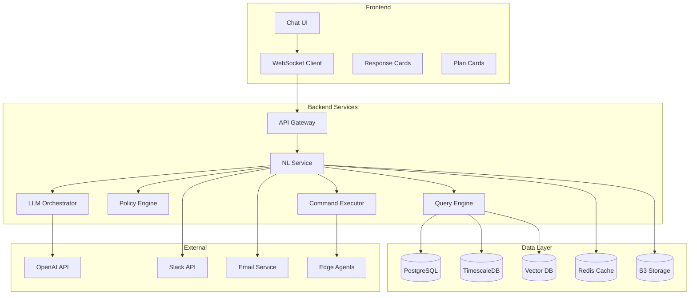

# Natural Language Lab Assistant - IMPLEMENTED ✅

## Executive Summary
**STATUS: COMPLETE (December 17, 2024)**

This document outlines the comprehensive implementation of the Natural Language Lab Assistant feature in Antevus - a conversational AI interface that enables scientists to control laboratory instruments, query data, and generate reports using natural language commands.

## 🎉 Implementation Complete
The Lab Assistant feature has been successfully implemented with the following capabilities:
- ✅ Full chat interface with streaming responses
- ✅ Thread management system (create, rename, delete, search)
- ✅ Persistent conversation history
- ✅ Smart suggested prompts
- ✅ Mobile-responsive design
- ✅ Production-ready state management
- ✅ Integrated with main dashboard

## Table of Contents
1. [Project Overview](#project-overview)
2. [Implementation Phases](#implementation-phases)
3. [Technical Architecture](#technical-architecture)
4. [Development Tasks](#development-tasks)
5. [Integration Points](#integration-points)
6. [Security & Compliance](#security-compliance)
7. [Testing Strategy](#testing-strategy)
8. [Deployment Plan](#deployment-plan)
9. [Success Metrics](#success-metrics)
10. [Risk Mitigation](#risk-mitigation)

## Project Overview

### Goal
Build a chat-based natural language interface that allows lab personnel to:
- Query instrument status and run history
- Control instruments with policy-enforced safety
- Generate reports and summaries
- Collaborate via integrated notifications

### Timeline
- **Duration**: 8-10 weeks
- **Team Size**: 3-4 engineers (Frontend, Backend, AI/ML, DevOps)
- **Sprint Length**: 2 weeks

### Key Deliverables
1. Chat interface with streaming responses
2. LLM integration with function calling
3. Policy engine for safe command execution
4. Audit trail system for compliance
5. Integration with existing Antevus infrastructure

## Implementation Phases

### Phase 1: Foundation (Weeks 1-2)
**Goal**: Set up core infrastructure and basic chat interface

#### Backend Tasks
- [ ] Set up LLM service architecture (FastAPI microservice)
- [ ] Configure OpenAI/Anthropic API integration
- [ ] Implement basic prompt templates and system prompts
- [ ] Create WebSocket/SSE infrastructure for streaming
- [ ] Set up vector database (pgvector) for embeddings
- [ ] Design database schema for chat sessions and audit logs

#### Frontend Tasks
- [ ] Create chat panel component with Tailwind CSS
- [ ] Implement message streaming UI with markdown support
- [ ] Build typing indicators and loading states
- [ ] Add collapsible/expandable chat interface
- [ ] Create basic message history display

#### DevOps Tasks
- [ ] Set up dedicated microservice containers
- [ ] Configure environment variables and secrets management
- [ ] Implement rate limiting for LLM API calls
- [ ] Set up monitoring and alerting

### Phase 2: Core Query Capabilities (Weeks 3-4)
**Goal**: Enable natural language queries for instrument data

#### Backend Tasks
- [ ] Implement function calling schema for queries
- [ ] Build SQL query generator from natural language
- [ ] Create embedding pipeline for semantic search
- [ ] Develop retrieval system for run history
- [ ] Implement context management for conversations
- [ ] Build response formatting for tables/charts

#### Frontend Tasks
- [ ] Create rich response cards (tables, charts, links)
- [ ] Implement data visualization components
- [ ] Add click-through navigation to detailed views
- [ ] Build export functionality for query results
- [ ] Create citation/source links in responses

#### Integration Tasks
- [ ] Connect to TimescaleDB for time-series data
- [ ] Integrate with existing instrument status APIs
- [ ] Link to run history and protocol databases
- [ ] Set up real-time data subscriptions

### Phase 3: Control Capabilities & Safety (Weeks 5-6)
**Goal**: Add instrument control with safety guardrails

#### Backend Tasks
- [ ] Design intent parser for control commands
- [ ] Implement action whitelist and validation
- [ ] Build dry-run preview generator
- [ ] Create idempotency system for commands
- [ ] Develop rollback mechanisms
- [ ] Implement command queue with status tracking

#### Frontend Tasks
- [ ] Create confirmation dialog components
- [ ] Build plan card UI with action preview
- [ ] Implement e-signature capture interface
- [ ] Add progress tracking for long-running commands
- [ ] Create cancel/abort functionality

#### Security Tasks
- [ ] Integrate OPA (Open Policy Agent) for ABAC
- [ ] Implement role-based permission checks
- [ ] Add command authorization workflow
- [ ] Create audit logging for all actions
- [ ] Build compliance report generator

### Phase 4: Advanced Features (Weeks 7-8)
**Goal**: Add reporting, collaboration, and multi-step workflows

#### Backend Tasks
- [ ] Build report generation system (PDF/CSV)
- [ ] Implement Slack/Teams integration
- [ ] Create scheduled report functionality
- [ ] Develop workflow orchestration engine
- [ ] Build template system for common queries
- [ ] Implement batch command execution

#### Frontend Tasks
- [ ] Create report preview interface
- [ ] Build notification preferences UI
- [ ] Add workflow builder interface
- [ ] Implement template gallery
- [ ] Create collaboration features (share chat)

#### Integration Tasks
- [ ] Connect to Slack/Teams APIs
- [ ] Integrate with email service
- [ ] Link to document storage (S3)
- [ ] Connect to ELN/LIMS systems

### Phase 5: Testing & Refinement (Weeks 9-10)
**Goal**: Comprehensive testing and optimization

#### Testing Tasks
- [ ] Unit tests for all components (>80% coverage)
- [ ] Integration testing with mock LLM
- [ ] End-to-end testing of critical paths
- [ ] Performance testing and optimization
- [ ] Security penetration testing
- [ ] Compliance validation testing

#### Optimization Tasks
- [ ] Implement response caching
- [ ] Optimize database queries
- [ ] Reduce LLM token usage
- [ ] Improve response latency
- [ ] Enhance error handling

## Technical Architecture

### System Components



### Technology Stack

#### Backend
```yaml
Core:
  - Language: Python 3.11+
  - Framework: FastAPI
  - Async: asyncio + aiohttp

LLM:
  - Primary: OpenAI GPT-4o with function calling
  - Fallback: Claude 3.5 Sonnet
  - Embeddings: OpenAI text-embedding-3-small

Databases:
  - PostgreSQL 15 with pgvector
  - TimescaleDB for metrics
  - Redis for caching

Security:
  - OPA for policy engine
  - JWT for authentication
  - TLS 1.3 for transport
```

#### Frontend
```yaml
Core:
  - Framework: Next.js 14
  - Language: TypeScript
  - Styling: Tailwind CSS v3

Components:
  - UI Library: Radix UI
  - Charts: Recharts
  - Markdown: react-markdown
  - WebSocket: socket.io-client

State:
  - React Query for API
  - Zustand for chat state
  - Context for auth
```

### API Endpoints

```typescript
// Natural Language Endpoints
interface NLEndpoints {
  // WebSocket for streaming chat
  WS: '/api/lab-assistant/chat'

  // REST endpoints
  POST: {
    '/api/lab-assistant/intent': IntentRequest => IntentResponse
    '/api/lab-assistant/execute': ExecuteRequest => ExecuteResponse
    '/api/lab-assistant/feedback': FeedbackRequest => void
  }

  GET: {
    '/api/lab-assistant/capabilities': void => Capability[]
    '/api/lab-assistant/history': HistoryParams => Message[]
    '/api/lab-assistant/templates': void => Template[]
  }
}

// Function Calling Schema
interface ToolFunctions {
  get_status: (site?: string, project?: string) => InstrumentStatus[]
  get_runs: (filter: RunFilter) => Run[]
  start_run: (params: RunParams) => RunResult
  stop_run: (runId: string) => StopResult
  summarize_runs: (dateRange: DateRange) => Summary
  export_report: (format: Format, destination: Destination) => ExportResult
}
```

## Development Tasks

### Sprint 1 (Weeks 1-2)
```markdown
Backend:
- [ ] Set up NL service repository and CI/CD
- [ ] Implement basic LLM integration
- [ ] Create WebSocket handler
- [ ] Design database schema
- [ ] Build prompt management system

Frontend:
- [ ] Create chat component structure
- [ ] Implement message streaming
- [ ] Build responsive layout
- [ ] Add dark mode support
- [ ] Create loading states

DevOps:
- [ ] Configure Docker containers
- [ ] Set up Kubernetes manifests
- [ ] Implement secrets management
- [ ] Configure monitoring
```

### Sprint 2 (Weeks 3-4)
```markdown
Backend:
- [ ] Implement function calling
- [ ] Build query engine
- [ ] Create embedding pipeline
- [ ] Develop context management
- [ ] Add response formatting

Frontend:
- [ ] Build rich response cards
- [ ] Implement data tables
- [ ] Add chart components
- [ ] Create export functionality
- [ ] Build error handling

Testing:
- [ ] Unit tests for query engine
- [ ] Integration tests for LLM
- [ ] Frontend component tests
```

### Sprint 3 (Weeks 5-6)
```markdown
Backend:
- [ ] Build intent parser
- [ ] Implement policy engine
- [ ] Create command executor
- [ ] Add audit logging
- [ ] Build rollback system

Frontend:
- [ ] Create confirmation dialogs
- [ ] Build plan cards
- [ ] Implement e-signature
- [ ] Add progress tracking
- [ ] Create abort mechanism

Security:
- [ ] Integrate OPA
- [ ] Implement RBAC
- [ ] Add command validation
- [ ] Create compliance reports
```

### Sprint 4 (Weeks 7-8)
```markdown
Backend:
- [ ] Build report generator
- [ ] Implement integrations
- [ ] Create workflow engine
- [ ] Add template system
- [ ] Implement scheduling

Frontend:
- [ ] Create report preview
- [ ] Build settings UI
- [ ] Add workflow builder
- [ ] Implement templates
- [ ] Create sharing features

Integration:
- [ ] Connect Slack/Teams
- [ ] Integrate email
- [ ] Link to storage
- [ ] Connect ELN/LIMS
```

### Sprint 5 (Weeks 9-10)
```markdown
Testing:
- [ ] Complete unit tests
- [ ] Run integration tests
- [ ] Perform E2E testing
- [ ] Execute load testing
- [ ] Conduct security audit

Optimization:
- [ ] Implement caching
- [ ] Optimize queries
- [ ] Reduce token usage
- [ ] Improve latency
- [ ] Enhance UX

Documentation:
- [ ] API documentation
- [ ] User guides
- [ ] Admin manual
- [ ] Security guidelines
```

## Integration Points

### Existing Antevus Services
```yaml
Instrument Service:
  - GET /api/instruments
  - GET /api/instruments/{id}/status
  - POST /api/instruments/{id}/commands

Run Service:
  - GET /api/runs
  - GET /api/runs/{id}
  - GET /api/runs/{id}/data
  - POST /api/runs/start

Protocol Service:
  - GET /api/protocols
  - GET /api/protocols/{id}
  - POST /api/protocols/validate

User Service:
  - GET /api/users/current
  - GET /api/users/permissions
  - POST /api/users/signature
```

### External Integrations
```yaml
Slack:
  - Webhook URL for notifications
  - OAuth for slash commands
  - Block kit for rich messages

Teams:
  - Incoming webhook connector
  - Adaptive cards for rich content
  - Bot framework for interactions

Email:
  - SendGrid/AWS SES for delivery
  - HTML templates for reports
  - Attachment support for exports

ELN/LIMS:
  - REST APIs for data push
  - OAuth for authentication
  - Webhook for updates
```

## Security & Compliance

### Security Requirements

#### Authentication & Authorization
```yaml
Authentication:
  - SSO via SAML/OIDC
  - MFA enforcement
  - Session management
  - API key rotation

Authorization:
  - Role-based access (RBAC)
  - Attribute-based access (ABAC)
  - Project-level permissions
  - Instrument-specific controls
```

#### Data Protection
```yaml
Encryption:
  - TLS 1.3 in transit
  - AES-256 at rest
  - Key rotation policy
  - Secure key storage

Privacy:
  - PII redaction in logs
  - GDPR compliance
  - Data retention policies
  - Right to deletion
```

### Compliance Features

#### 21 CFR Part 11
```yaml
Electronic Records:
  - Immutable audit trail
  - Version control
  - Backup and recovery
  - Data integrity checks

Electronic Signatures:
  - User authentication
  - Signature binding
  - Non-repudiation
  - Timestamp accuracy
```

#### Audit Trail
```yaml
Logging:
  - User actions
  - System events
  - Data changes
  - Access attempts

Storage:
  - WORM compliance
  - Tamper-proof
  - Searchable
  - Exportable
```

## Testing Strategy

### Test Coverage Requirements
```yaml
Unit Tests: >80% coverage
Integration Tests: All API endpoints
E2E Tests: Critical user paths
Performance Tests: <3s P95 latency
Security Tests: OWASP Top 10
```

### Test Scenarios

#### Functional Tests
```markdown
1. Query Tests
   - Simple status queries
   - Complex filter queries
   - Historical data queries
   - Invalid query handling

2. Control Tests
   - Valid command execution
   - Permission denial
   - Confirmation flow
   - Rollback scenarios

3. Report Tests
   - Report generation
   - Export formats
   - Scheduling
   - Delivery methods
```

#### Non-Functional Tests
```markdown
1. Performance
   - Response time under load
   - Concurrent user handling
   - Token optimization
   - Database query performance

2. Security
   - SQL injection prevention
   - Command injection prevention
   - Authorization bypass attempts
   - Rate limiting effectiveness

3. Reliability
   - Network failure recovery
   - LLM API failures
   - Database connection issues
   - Message queue failures
```

## Deployment Plan

### Environment Strategy
```yaml
Development:
  - Local Docker Compose
  - Mock LLM responses
  - Test data fixtures
  - Hot reload enabled

Staging:
  - Kubernetes cluster
  - Real LLM integration
  - Production-like data
  - Performance monitoring

Production:
  - Multi-region deployment
  - Auto-scaling enabled
  - Full monitoring suite
  - Disaster recovery ready
```

### Rollout Strategy

#### Phase 1: Internal Beta
- **Duration**: 1 week
- **Users**: Internal team only
- **Focus**: Basic functionality validation

#### Phase 2: Limited Beta
- **Duration**: 2 weeks
- **Users**: 5-10 selected customers
- **Focus**: Real-world usage patterns

#### Phase 3: General Availability
- **Duration**: Ongoing
- **Users**: All customers
- **Focus**: Scale and optimization

### Monitoring & Observability
```yaml
Metrics:
  - Response time percentiles
  - Token usage per request
  - Error rates by type
  - User engagement metrics

Logs:
  - Application logs (JSON)
  - Access logs
  - Audit logs
  - LLM interaction logs

Traces:
  - Distributed tracing
  - Request flow visualization
  - Performance bottlenecks
  - Error propagation

Alerts:
  - High error rates
  - Slow response times
  - Failed authentications
  - Policy violations
```

## Success Metrics

### Business Metrics
```yaml
Adoption:
  - Target: 50% DAU engagement in 30 days
  - Measurement: Unique users per day

Usage:
  - Target: 100+ commands per day per lab
  - Measurement: Total commands executed

Efficiency:
  - Target: 50% reduction in manual operations
  - Measurement: Time saved surveys

Satisfaction:
  - Target: 4.5+ star rating
  - Measurement: In-app feedback
```

### Technical Metrics
```yaml
Performance:
  - P95 response time < 3 seconds
  - P99 response time < 5 seconds
  - Uptime > 99.9%

Quality:
  - Intent accuracy > 95%
  - Command success rate > 90%
  - Error rate < 1%

Security:
  - Zero unauthorized actions
  - 100% audit coverage
  - Zero data breaches
```

## Risk Mitigation

### Technical Risks

#### LLM Reliability
```yaml
Risk: LLM API outages or degraded performance
Mitigation:
  - Implement fallback to secondary LLM
  - Cache common responses
  - Graceful degradation to basic commands
  - Clear error messaging to users
```

#### Data Accuracy
```yaml
Risk: Incorrect data returned or commands executed
Mitigation:
  - Strict schema validation
  - Dry-run previews
  - Human confirmation required
  - Comprehensive testing
```

### Operational Risks

#### User Adoption
```yaml
Risk: Low user engagement with NL interface
Mitigation:
  - Intuitive onboarding
  - Template library
  - Progressive disclosure
  - Training materials
```

#### Compliance Issues
```yaml
Risk: Regulatory non-compliance
Mitigation:
  - Complete audit trail
  - E-signature implementation
  - Regular compliance audits
  - Documentation maintenance
```

## Appendices

### A. Database Schema

```sql
-- Chat sessions table
CREATE TABLE chat_sessions (
    id UUID PRIMARY KEY DEFAULT gen_random_uuid(),
    user_id UUID NOT NULL REFERENCES users(id),
    project_id UUID REFERENCES projects(id),
    started_at TIMESTAMP NOT NULL DEFAULT NOW(),
    ended_at TIMESTAMP,
    metadata JSONB
);

-- Messages table
CREATE TABLE chat_messages (
    id UUID PRIMARY KEY DEFAULT gen_random_uuid(),
    session_id UUID NOT NULL REFERENCES chat_sessions(id),
    role VARCHAR(50) NOT NULL CHECK (role IN ('user', 'assistant', 'system')),
    content TEXT NOT NULL,
    metadata JSONB,
    created_at TIMESTAMP NOT NULL DEFAULT NOW()
);

-- Intents table
CREATE TABLE chat_intents (
    id UUID PRIMARY KEY DEFAULT gen_random_uuid(),
    message_id UUID NOT NULL REFERENCES chat_messages(id),
    intent_type VARCHAR(100) NOT NULL,
    parameters JSONB,
    confidence FLOAT,
    created_at TIMESTAMP NOT NULL DEFAULT NOW()
);

-- Actions table
CREATE TABLE chat_actions (
    id UUID PRIMARY KEY DEFAULT gen_random_uuid(),
    intent_id UUID NOT NULL REFERENCES chat_intents(id),
    action_type VARCHAR(100) NOT NULL,
    status VARCHAR(50) NOT NULL,
    result JSONB,
    executed_at TIMESTAMP,
    executed_by UUID REFERENCES users(id)
);

-- Audit log table
CREATE TABLE chat_audit_log (
    id UUID PRIMARY KEY DEFAULT gen_random_uuid(),
    session_id UUID REFERENCES chat_sessions(id),
    user_id UUID NOT NULL REFERENCES users(id),
    action VARCHAR(255) NOT NULL,
    details JSONB,
    ip_address INET,
    user_agent TEXT,
    created_at TIMESTAMP NOT NULL DEFAULT NOW()
);
```

### B. LLM System Prompts

```python
SYSTEM_PROMPT = """
You are the Antevus Lab Assistant, a helpful AI that assists scientists with laboratory operations.

Your capabilities include:
1. Querying instrument status and run history
2. Starting, stopping, and monitoring instrument runs
3. Generating reports and summaries
4. Sending notifications to team members

Important guidelines:
- Always confirm before executing any state-changing action
- Provide clear, concise responses
- Include relevant links and references
- Respect user permissions and lab policies
- Never execute commands without explicit confirmation

Current context:
- User: {user_name}
- Role: {user_role}
- Project: {current_project}
- Lab: {lab_name}
"""

INTENT_CLASSIFICATION_PROMPT = """
Classify the user's intent into one of these categories:
- QUERY: Requesting information or status
- CONTROL: Requesting to start/stop/modify instrument operation
- REPORT: Requesting report generation or data export
- NOTIFY: Requesting to send notifications or alerts
- HELP: Asking for help or documentation
- OTHER: Anything else

Return a JSON object with:
{{
  "intent": "CATEGORY",
  "confidence": 0.0-1.0,
  "parameters": {{extracted parameters}},
  "requires_confirmation": boolean
}}
"""
```

### C. Configuration Templates

```yaml
# config/nl-assistant.yaml
llm:
  provider: openai
  model: gpt-4-turbo-preview
  temperature: 0.3
  max_tokens: 2000
  timeout_seconds: 30

embeddings:
  provider: openai
  model: text-embedding-3-small
  dimensions: 1536

vector_db:
  provider: pgvector
  collection: lab_assistant
  similarity_threshold: 0.8

policy:
  require_confirmation: true
  max_actions_per_command: 5
  allowed_actions:
    - get_status
    - get_runs
    - start_run
    - stop_run
    - export_report

security:
  rate_limit:
    requests_per_minute: 60
    tokens_per_hour: 100000

  audit:
    enabled: true
    retention_days: 2555

  encryption:
    at_rest: true
    in_transit: true
```

### D. Example Interactions

```typescript
// Example 1: Status Query
User: "What instruments are currently running?"
Assistant: {
  type: "status_response",
  data: {
    running: [
      { id: "PCR-001", name: "qPCR System", protocol: "COVID-19 Detection", timeRemaining: "23 min" },
      { id: "SEQ-003", name: "MiSeq", protocol: "16S rRNA Sequencing", timeRemaining: "4h 12min" }
    ],
    idle: ["HPLC-002", "MS-001"],
    offline: []
  },
  message: "2 instruments are currently running. The qPCR will complete in 23 minutes."
}

// Example 2: Control Command
User: "Start ELISA protocol on PR-07 with plate PLT-2219"
Assistant: {
  type: "action_confirmation",
  data: {
    action: "start_run",
    instrument: "PR-07",
    protocol: "ELISA_v3",
    parameters: { plate_id: "PLT-2219" },
    estimatedDuration: "45 minutes",
    requiredApprovals: ["lab_manager"]
  },
  message: "Ready to start ELISA protocol. This will take approximately 45 minutes. Please confirm to proceed."
}

// Example 3: Report Generation
User: "Generate a summary of today's qPCR runs and send to the QA team"
Assistant: {
  type: "report_generated",
  data: {
    reportId: "RPT-20240115-001",
    summary: {
      totalRuns: 12,
      successful: 10,
      failed: 2,
      averageCt: 24.3
    },
    recipients: ["qa@lab.com"],
    format: "PDF"
  },
  message: "Report generated and sent to QA team. 2 runs failed QC checks - details in the attached report."
}
```

## Conclusion

This implementation plan provides a comprehensive roadmap for building the Natural Language Lab Assistant feature. The phased approach ensures incremental value delivery while maintaining focus on safety, compliance, and user experience. Success depends on close collaboration between engineering, product, and customer teams to iterate based on real-world feedback and usage patterns.

### Next Steps
1. Review and approve implementation plan
2. Assemble development team
3. Set up development environment
4. Begin Sprint 1 execution
5. Schedule weekly progress reviews

### Key Success Factors
- Strong LLM integration with robust error handling
- Intuitive UI/UX that doesn't overwhelm users
- Comprehensive safety guardrails and policy enforcement
- Seamless integration with existing Antevus infrastructure
- Continuous iteration based on user feedback

### Contact
For questions or clarifications about this implementation plan, please contact:
- Product: gabeviggers@gmail.com
- Engineering: [engineering-team]
- Architecture: [architect-team]