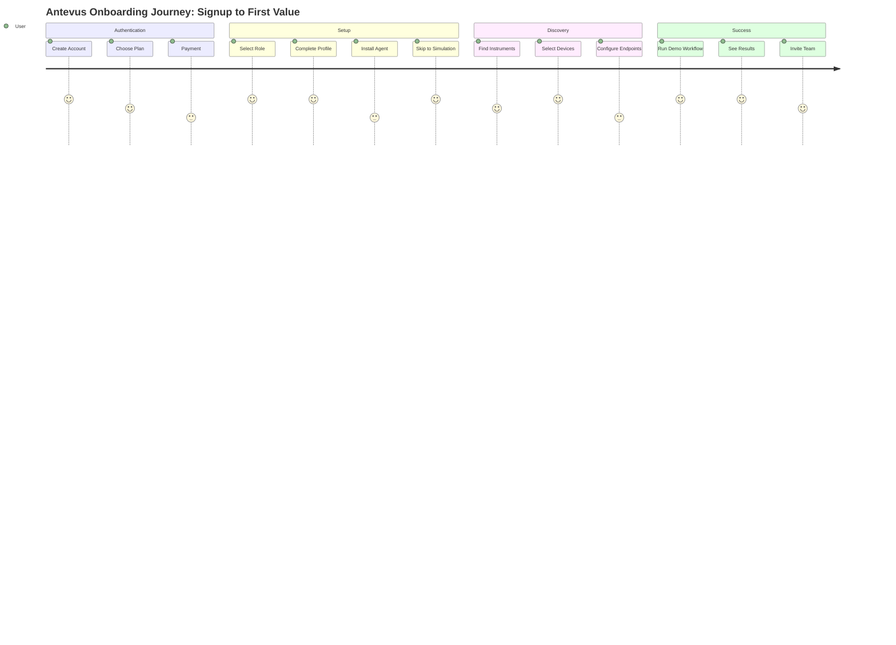

# Antevus Onboarding Flow V1
## Self-Serve Signup to First Value in <10 Minutes

### Design Principles
- **Time-to-value < 10 min**: New user sees live "lab" with simulated instruments + demo run
- **One decision per screen**: Minimal fields, clear CTAs
- **No dead ends**: Complete onboarding with simulation if IT isn't ready
- **Privacy & compliance by default**: Desktop notifications "no previews", least-privileged roles, HMAC everywhere

---

## User Journey Map



---

## Detailed Flow Screens

### Screen A: Create Your Workspace ✅ COMPLETE
**URL**: `/signup`
**Status**: Built in `/app/(auth)/signup/page.tsx`

#### Layout
```
┌─────────────────────────────────────┐
│         🧪 Antevus                  │
├─────────────────────────────────────┤
│                                     │
│     Create your workspace           │
│                                     │
│  Set up Antevus for your lab.      │
│  You can invite teammates later.    │
│                                     │
│  ┌─────────────────────────────┐   │
│  │ 🔷 Continue with Google     │   │
│  └─────────────────────────────┘   │
│                                     │
│  ┌─────────────────────────────┐   │
│  │ 🐙 Continue with GitHub     │   │
│  └─────────────────────────────┘   │
│                                     │
│  ─────── or sign up with ──────    │
│                                     │
│  Email *                            │
│  [you@laboratory.com           ]   │
│                                     │
│  Password *                    👁   │
│  [••••••••••                  ]   │
│  ✓ 12+ characters                  │
│  ✓ Contains number or symbol       │
│                                     │
│  Confirm Password *            👁   │
│  [••••••••••                  ]   │
│                                     │
│  [Create Account] (disabled)       │
│                                     │
│  Already have an account? Sign in  │
└─────────────────────────────────────┘
```

#### Validation
- Email: Valid format
- Password: ≥12 chars, 1 number/symbol
- Confirm: Must match
- SSO: Prefill name/avatar

#### Actions
- On submit: Create User + Workspace
- Analytics: `signup_start`, auth method
- Redirect: To plan selection

---

### Screen B: Choose Your Plan
**URL**: `/signup/plan`

#### Layout
```
┌─────────────────────────────────────┐
│  Step 1 of 2 · Choose your plan    │
├─────────────────────────────────────┤
│                                     │
│  🎓 Academic institution? Save 40%  │
│  [Toggle: OFF]                      │
│                                     │
│  ┌──────────────────────────────┐  │
│  │        CORE                   │  │
│  │     $1,500/month              │  │
│  │                                │  │
│  │  ✓ Up to 10 instruments       │  │
│  │  ✓ 1M events/month            │  │
│  │  ✓ 200k AI tokens              │  │
│  │  ✓ 100GB storage              │  │
│  │                                │  │
│  │  [Select Core]                │  │
│  └──────────────────────────────┘  │
│                                     │
│  ┌──────────────────────────────┐  │
│  │        TEAM                   │  │
│  │     $4,000/month              │  │
│  │     Most Popular               │  │
│  │                                │  │
│  │  ✓ Up to 25 instruments       │  │
│  │  ✓ 3M events/month            │  │
│  │  ✓ 750k AI tokens              │  │
│  │  ✓ 500GB storage              │  │
│  │                                │  │
│  │  [Select Team]                │  │
│  └──────────────────────────────┘  │
│                                     │
│  ┌──────────────────────────────┐  │
│  │        SCALE                  │  │
│  │     $7,500/month              │  │
│  │                                │  │
│  │  ✓ Up to 50 instruments       │  │
│  │  ✓ 8M events/month            │  │
│  │  ✓ 2M AI tokens               │  │
│  │  ✓ 2TB storage                │  │
│  │                                │  │
│  │  [Select Scale]               │  │
│  └──────────────────────────────┘  │
│                                     │
│  📞 Have a PO or need a pilot?     │
│     Talk to sales                  │
│                                     │
│  [Continue to checkout]            │
└─────────────────────────────────────┘
```

#### Actions
- Academic toggle: Apply 40% discount
- Select plan: Enable checkout button
- Talk to sales: Opens contact form
- Continue: Opens Stripe Checkout

---

### Screen C: Tell Us Who You Are
**URL**: `/onboarding/role`

#### Layout
```
┌─────────────────────────────────────┐
│  Welcome to Antevus!                │
├─────────────────────────────────────┤
│                                     │
│  Tell us who you are                │
│  This helps us customize your      │
│  experience                        │
│                                     │
│  ○ 👨‍🔬 Scientist/Researcher        │
│     Run experiments, analyze data   │
│                                     │
│  ○ 💻 Lab Automation/IT            │
│     Install agents, manage APIs    │
│                                     │
│  ○ 📊 Lab Manager                  │
│     Monitor usage, invite team     │
│                                     │
│  ○ ✅ Compliance Officer           │
│     Audit logs, e-signatures       │
│                                     │
│  [Continue →]                       │
└─────────────────────────────────────┘
```

#### Effects
- Sets default permissions
- Shows role-specific hints
- Configures privacy defaults

---

### Wizard Step 1: Profile
**URL**: `/onboarding/profile`

#### Layout
```
┌─────────────────────────────────────┐
│  ○───○───○───○───○  Step 1 of 5    │
├─────────────────────────────────────┤
│                                     │
│  Complete your profile              │
│                                     │
│  Name *                             │
│  [John Smith               ]       │
│                                     │
│  Organization Name *                │
│  [Acme Laboratories        ]       │
│                                     │
│  Time Zone *                        │
│  [▼ America/New_York      ]       │
│                                     │
│  Appearance                         │
│  ○ Light  ● Dark  ○ System         │
│                                     │
│  Desktop Notifications              │
│  □ Enable desktop notifications    │
│  ☑ Privacy: No previews           │
│  ℹ Hides sensitive content         │
│                                     │
│  [Save & Continue →]                │
└─────────────────────────────────────┘
```

---

### Wizard Step 2: Connect the Edge Agent
**URL**: `/onboarding/agent`

#### Layout
```
┌─────────────────────────────────────┐
│  ●───○───○───○───○  Step 2 of 5    │
├─────────────────────────────────────┤
│                                     │
│  Connect the Edge Agent             │
│                                     │
│  Download for your platform:        │
│                                     │
│  ┌────┐ ┌────┐ ┌────┐              │
│  │ 🪟 │ │ 🍎 │ │ 🐧 │              │
│  │Win │ │Mac │ │Linux│              │
│  └────┘ └────┘ └────┘              │
│                                     │
│  Your Join Token (30 min)          │
│  ┌─────────────────────────────┐   │
│  │ ANT-XY7K-9PQ2-MNBV          │   │
│  │ [📋 Copy]                    │   │
│  └─────────────────────────────┘   │
│                                     │
│  Installation Steps:                │
│  1. Install the agent              │
│  2. Paste join token when asked    │
│  3. Agent appears below            │
│                                     │
│  Status: ⏳ Waiting for agent...   │
│                                     │
│  [Skip for now →]                  │
│  Use simulation mode               │
└─────────────────────────────────────┘
```

#### Live Updates
- Waiting → Connecting → ✅ Connected
- Show agent details when connected
- Enable Continue when connected

---

### Wizard Step 3: Discover & Select Instruments
**URL**: `/onboarding/instruments`

#### Layout
```
┌─────────────────────────────────────┐
│  ●───●───○───○───○  Step 3 of 5    │
├─────────────────────────────────────┤
│                                     │
│  Discover & Select Instruments     │
│                                     │
│  🔍 Scanning network...             │
│                                     │
│  ┌─────────────────────────────┐   │
│  │ □ HPLC-Agilent-1200         │   │
│  │   Model: 1200 Series         │   │
│  │   Serial: DE12345678         │   │
│  │   Status: ✅ Online          │   │
│  ├─────────────────────────────┤   │
│  │ □ qPCR-BioRad-CFX96         │   │
│  │   Model: CFX96               │   │
│  │   Serial: BR98765432         │   │
│  │   Status: ✅ Online          │   │
│  ├─────────────────────────────┤   │
│  │ □ PlateReader-Tecan-M200    │   │
│  │   Model: Infinite M200       │   │
│  │   Serial: TC11223344         │   │
│  │   Status: ⚠️ Idle            │   │
│  └─────────────────────────────┘   │
│                                     │
│  ℹ️ No instruments? Continue with   │
│     simulation mode                 │
│                                     │
│  [Onboard Selected →]              │
└─────────────────────────────────────┘
```

#### What Gets Configured
- Data normalization
- Secure channel (mTLS)
- Local buffering
- Audit logging

---

### Wizard Step 4: Endpoints & Webhooks
**URL**: `/onboarding/endpoints`

#### Layout
```
┌─────────────────────────────────────┐
│  ●───●───●───○───○  Step 4 of 5    │
├─────────────────────────────────────┤
│                                     │
│  Endpoints & Webhooks (No-Code)    │
│                                     │
│  Organization API Key               │
│  (For agent/webhooks/data only)    │
│  ┌─────────────────────────────┐   │
│  │ ant_live_xK9p2...           │   │
│  │ [👁 Reveal] [🔄 Rotate]     │   │
│  └─────────────────────────────┘   │
│                                     │
│  HMAC Webhook Secret                │
│  ┌─────────────────────────────┐   │
│  │ whsec_Qm4x7...              │   │
│  │ [👁 Reveal] [🔄 Rotate]     │   │
│  └─────────────────────────────┘   │
│                                     │
│  Your Endpoints:                    │
│  ┌─────────────────────────────┐   │
│  │ Ingest URL (HTTPS)          │   │
│  │ https://api.antevus.com/    │   │
│  │ v1/ingest                   │   │
│  │ [📋 Copy]                   │   │
│  ├─────────────────────────────┤   │
│  │ Events URL (WebSocket)      │   │
│  │ wss://api.antevus.com/      │   │
│  │ v1/events                   │   │
│  │ [📋 Copy]                   │   │
│  ├─────────────────────────────┤   │
│  │ Webhook Header Example      │   │
│  │ X-Antevus-Signature: {hmac} │   │
│  │ [📋 Copy]                   │   │
│  └─────────────────────────────┘   │
│                                     │
│  [Send Test Event]                 │
│  ✅ Success: 200 OK, HMAC valid    │
│                                     │
│  [Continue →]                      │
└─────────────────────────────────────┘
```

#### Security Notes
- Keys reveal once only
- Rotation creates audit event
- Test verifies HMAC signature
- No LLM keys (platform-managed)

---

### Wizard Step 5: Hello Workflow
**URL**: `/onboarding/hello`

#### Layout
```
┌─────────────────────────────────────┐
│  ●───●───●───●───●  Step 5 of 5    │
├─────────────────────────────────────┤
│                                     │
│  Run Your First Workflow            │
│                                     │
│  Online Instruments:                │
│  🟢 HPLC-01  🟢 qPCR-02  🟢 PR-03  │
│                                     │
│  ┌─────────────────────────────┐   │
│  │ [▶️ Start ELISA dry-run]     │   │
│  │     on PlateReader-03        │   │
│  └─────────────────────────────┘   │
│                                     │
│  Status Timeline:                   │
│  ─────────────────────────────      │
│  ✅ Initializing...                 │
│  ✅ Loading plate...                │
│  ⏳ Reading wells... (45s)         │
│  ⏳ Processing data...              │
│  ⏳ Generating report...            │
│                                     │
│  Results:                           │
│  ┌─────────────────────────────┐   │
│  │ Well  | OD450 | Status      │   │
│  │ A1    | 2.34  | ✅ Positive │   │
│  │ A2    | 0.12  | ⭕ Negative │   │
│  │ A3    | 2.18  | ✅ Positive │   │
│  └─────────────────────────────┘   │
│                                     │
│  [📥 Download CSV]                 │
│  [📊 Open in Dashboard]            │
│                                     │
│  Optional Setup:                    │
│  ▼ Configure Integrations          │
│  ▼ Set Usage Alerts                │
│                                     │
│  [Finish Setup →]                  │
└─────────────────────────────────────┘
```

#### Optional Toggles
- **Slack Integration**: Paste webhook URL
- **Email Notifications**: Configure addresses
- **Usage Alerts**: Set 80%/95% thresholds

---

## Post-Onboarding Dashboard
**URL**: `/dashboard`

### Layout
```
┌─────────────────────────────────────┐
│  Welcome to Antevus Dashboard       │
├─────────────────────────────────────┤
│                                     │
│  Getting Started Checklist          │
│  ════════════════ 40% Complete     │
│                                     │
│  ✅ Run a demo workflow            │
│  ☐ Connect a real instrument       │
│  ☐ Invite team members             │
│  ☐ Set usage alerts                │
│  ☐ Enable Compliance Pack          │
│                                     │
│  ┌─────────────────────────────┐   │
│  │     Usage This Month         │   │
│  │                               │   │
│  │ Events:    12K / 1M          │   │
│  │ ▓░░░░░░░░░░░░░░ 1.2%        │   │
│  │                               │   │
│  │ AI Tokens: 3.2K / 200K       │   │
│  │ ▓░░░░░░░░░░░░░░ 1.6%        │   │
│  │                               │   │
│  │ Storage:   0.5GB / 100GB     │   │
│  │ ▓░░░░░░░░░░░░░░ 0.5%        │   │
│  │                               │   │
│  │ Forecast: $1,500 (on track)  │   │
│  └─────────────────────────────┘   │
│                                     │
│  ⚠️ Pilot Invoice Sent              │
│  90 days remaining · View invoice  │
└─────────────────────────────────────┘
```

---

## Invite Team Modal
**Trigger**: "Invite team members" from checklist

### Layout
```
┌─────────────────────────────────────┐
│  Invite Your Team                 ✕ │
├─────────────────────────────────────┤
│                                     │
│  Email Addresses                    │
│  Separate multiple with commas     │
│  ┌─────────────────────────────┐   │
│  │ alice@lab.com, bob@lab.com │   │
│  └─────────────────────────────┘   │
│                                     │
│  Default Role                       │
│  [▼ Scientist              ]       │
│                                     │
│  Permissions:                       │
│  • View all data                   │
│  • Start dry-runs                  │
│  • Request approvals               │
│                                     │
│  ℹ️ You can change roles anytime    │
│     in Settings → Access           │
│                                     │
│  [Cancel]  [Send Invites]          │
└─────────────────────────────────────┘
```

---

## Email Templates

### 1. Welcome Email
```
Subject: You're live on Antevus — connect an instrument in 2 minutes 🧪

Hi {{name}},

Your Antevus workspace is ready! Here's your quick-start:

1. 🔗 Log in: {{dashboardUrl}}
2. 📥 Download Edge Agent: {{agentUrl}}
3. 🔑 Your join token: {{joinToken}}
4. 🚀 Connect your first instrument

Need help? Book 15 minutes with your success manager:
{{calendarLink}}

Or jump straight to simulation mode to see Antevus in action.

Best,
The Antevus Team

P.S. Your trial includes 3 months of full access + white-glove support
```

### 2. Agent Reminder (24h)
```
Subject: Ready when you are: connect your first instrument

Hi {{name}},

We noticed you haven't installed the Edge Agent yet.
No worries — it takes less than 10 minutes!

Download here: {{agentDownloadUrl}}
Your join token: {{joinToken}} (expires in 24 hours)

Can't install right now? Continue with simulation mode:
{{simulationUrl}}

Video walkthrough: {{videoUrl}}

Reply for help or join office hours tomorrow at 2 PM EST.

Best,
The Antevus Team
```

### 3. Pilot KPI Snapshot (Weekly)
```
Subject: Week {{week}}: You've saved {{hours}} hours already 📊

Hi {{name}},

Your Antevus pilot - Week {{week}} metrics:

📊 By the numbers:
• Instruments connected: {{instrumentCount}}
• Runs completed: {{runCount}}
• Time saved: {{timeSaved}} hours
• Data processed: {{dataVolume}} GB
• Team members active: {{activeUsers}}

🎯 You're {{percentToGoal}}% toward your goal of {{goal}}

📈 This week's focus:
{{weeklyFocus}}

Review full dashboard: {{dashboardUrl}}

Best,
Your Success Manager
```

---

## Security & Compliance Defaults

### Desktop Notifications
- **Opt-in only**: Must explicitly enable
- **No previews ON**: Default for all roles
- **Locked for Compliance**: Cannot disable privacy

### API Security
- **Org API Key**: Reveal once, mask after
- **HMAC Secret**: Single reveal, rotation audited
- **Join Token**: 30-min TTL, single use
- **Webhook Verification**: Timestamp + signature

### LLM Security (Platform-Managed)
- **Server proxy only**: No customer keys
- **Per-org metering**: Token tracking
- **Prompt redaction**: PHI/PII filtering
- **Retention policy**: 30-day default
- **Audit trail**: All AI interactions logged

### RBAC Defaults

| Role | Instruments | Data | Billing | Audit | AI |
|------|------------|------|---------|-------|-----|
| **Scientist** | View | Full | None | None | Use |
| **IT/Automation** | Manage | View | None | View | None |
| **Manager** | View | View | Full | View | View |
| **Compliance** | None | Export | None | Full | Audit |

---

## Edge Cases & Fallbacks

### Agent Installation Blocked
- **Detection**: No connection after 5 min
- **Action**: Show "Continue with simulation"
- **Email**: IT-friendly installation guide

### No Instruments Found
- **Detection**: Empty discovery after scan
- **Options**:
  - Manual add (model/serial)
  - Retry scan
  - Continue with simulation

### Stripe Payment Failure
- **Display**: Inline error message
- **Options**:
  - Retry payment
  - Contact sales
  - Start with trial

### Pilot Invoice Unpaid
- **Display**: Non-blocking banner
- **Grace period**: 30 days
- **Soft limits**: After grace expires

---

## Analytics Events

### Funnel Tracking
```javascript
// Screen A - Signup
analytics.track('signup_start', {
  method: 'email|google|github'
})

// Screen B - Plan
analytics.track('plan_selected', {
  tier: 'core|team|scale',
  academic: boolean,
  pilot_requested: boolean
})

// Screen C - Role
analytics.track('role_selected', {
  role: 'scientist|it|manager|compliance'
})

// Wizard Steps
analytics.track('onboarding_step', {
  step: 1-5,
  completed: boolean,
  skipped: boolean
})

// Success Metrics
analytics.track('first_value', {
  time_to_value_seconds: number,
  demo_completed: boolean,
  real_instrument: boolean
})
```

---

## Acceptance Criteria

### Must Have (P0)
- [ ] User reaches demo run in ≤10 minutes
- [ ] Simulation works without hardware
- [ ] Payment processes correctly
- [ ] API keys generate and rotate
- [ ] HMAC webhooks validate
- [ ] Desktop notifications respect privacy
- [ ] Usage meters display accurately
- [ ] Audit events log correctly

### Should Have (P1)
- [ ] Real instrument connects in ≤15 min
- [ ] SSO prefills user data
- [ ] Academic discount applies
- [ ] Pilot invoice generates
- [ ] Team invites send
- [ ] Slack integration works
- [ ] Export functionality works

### Nice to Have (P2)
- [ ] Video tutorials embedded
- [ ] Live chat support
- [ ] Multiple language support
- [ ] Mobile responsive
- [ ] Offline mode hints

---

## Implementation Checklist

### Frontend Components
- [ ] Auth providers (Google, GitHub, Email)
- [ ] Plan selection cards
- [ ] Role selector
- [ ] Multi-step wizard
- [ ] Agent download cards
- [ ] Join token display
- [ ] Discovery table
- [ ] API key reveal/mask
- [ ] Webhook tester
- [ ] Demo workflow runner
- [ ] Usage meters
- [ ] Invite modal

### Backend APIs
- [ ] User registration
- [ ] Workspace provisioning
- [ ] Stripe Checkout webhook
- [ ] Stripe Invoice creation
- [ ] Join token generation
- [ ] Instrument discovery
- [ ] API key management
- [ ] HMAC generation/validation
- [ ] Usage tracking
- [ ] Email service

### Security
- [ ] Password policy enforcement
- [ ] JWT token generation
- [ ] RBAC implementation
- [ ] Audit logging
- [ ] Rate limiting
- [ ] HMAC verification
- [ ] Token expiry

### Infrastructure
- [ ] Database migrations
- [ ] Redis for tokens
- [ ] S3 for exports
- [ ] Email templates
- [ ] Analytics integration
- [ ] Error tracking
- [ ] Monitoring

---

*Document Version: 1.0.0*
*Last Updated: September 18, 2025*
*Status: READY FOR IMPLEMENTATION*