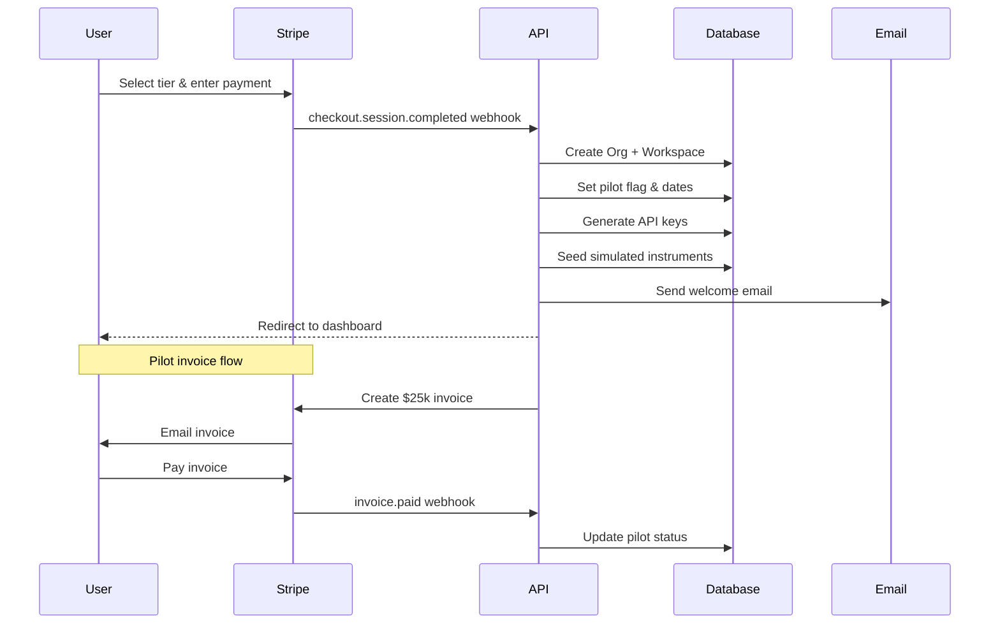
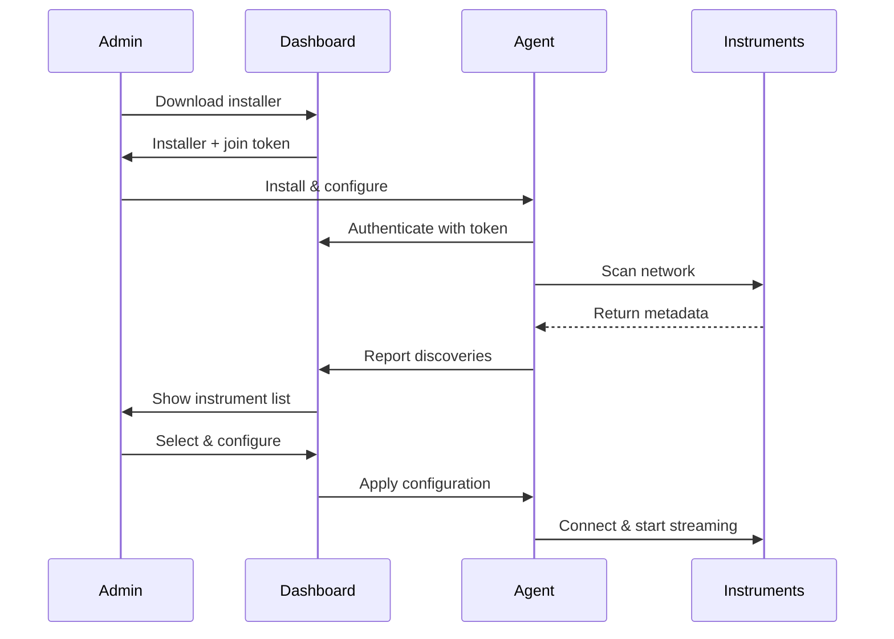
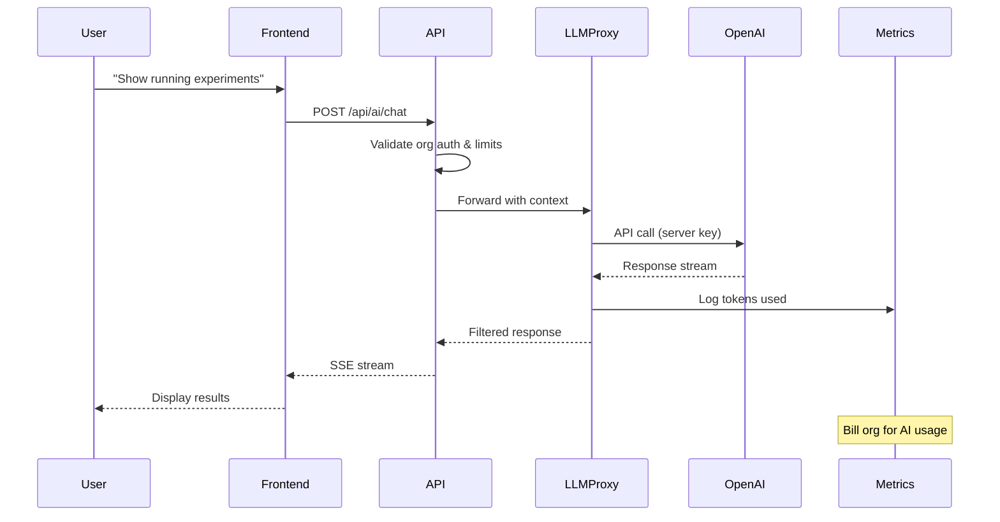

# Antevus 90-Day Pilot + Monthly Subscription Onboarding

## Executive Summary

Antevus offers a **hybrid commercial model** combining a **$25,000 90-day pilot** with **tiered monthly subscriptions** (Core/Team/Scale). This approach enables customers to prove ROI before committing to enterprise contracts while maintaining immediate revenue through monthly subscriptions.

**Key Innovation**: All LLM/AI capabilities are **platform-managed** - customers never provide API keys, ensuring security and simplifying adoption.

---

## Commercial Structure

### Pilot Program
- **Cost**: $25,000 (one-time)
- **Duration**: 90 days
- **Payment**: Invoice via Stripe Invoicing
- **Includes**:
  - White-glove onboarding
  - Custom connector setup (up to 5 instruments)
  - Dedicated success manager
  - Weekly KPI reviews
  - Sample workflows & templates
  - 3+ real instruments streaming
  - Simulation environment

### Monthly Subscription Tiers

| Tier | Monthly Cost | Instruments | Events/mo | AI Tokens/mo | Storage |
|------|-------------|-------------|-----------|--------------|---------|
| **Core** | $1,500 | Up to 10 | 1M | 200k | 100GB |
| **Team** | $4,000 | Up to 25 | 3M | 750k | 500GB |
| **Scale** | $7,500 | Up to 50 | 8M | 2M | 2TB |
| **Enterprise** | Custom | Unlimited | Custom | Custom | Custom |

### Overage Pricing
- **Events**: $0.001 per 1k events
- **AI Tokens**: $0.02 per 1k tokens (platform-managed)
- **Storage**: $0.10 per GB/month
- **Premium Connectors**: $200-500/month each

---

## Target Users & Roles

### 1. Tech Admin (Lab Automation/IT)
- **Primary Tasks**: Install Edge Agent, configure connectors, manage API keys
- **Success Metrics**: <30min setup, 99.9% uptime, zero security incidents
- **Tools**: Edge Agent installer, API key management, connector wizard

### 2. Scientist/Researcher
- **Primary Tasks**: Run workflows, query data, verify results, use Lab Assistant
- **Success Metrics**: 50% time saved, <5min to first result, validated data accuracy
- **Tools**: Dashboard, Lab Assistant chat, export functions

### 3. Lab Manager
- **Primary Tasks**: Invite team, set budgets, track ROI, monitor usage
- **Success Metrics**: Team adoption >80%, ROI >3x, usage within budget
- **Tools**: Admin panel, usage dashboard, billing controls

### 4. Compliance Officer
- **Primary Tasks**: Enable audit logs, configure e-signatures, validate exports
- **Success Metrics**: 100% audit coverage, CFR Part 11 compliance, zero violations
- **Tools**: Compliance Pack, audit viewer, policy editor

---

## Golden Path: Day 0 → Day 7

### Day 0: Purchase & Provisioning
1. **Checkout Flow** (5 min)
   - Select tier (Core/Team/Scale)
   - Enter payment details (card/ACH)
   - Company information for pilot invoice
   - Accept terms & conditions

2. **Instant Provisioning**
   - Organization created
   - Workspace configured
   - Pilot flag activated
   - 3 simulated instruments seeded
   - Initial API key generated
   - Usage credits allocated

3. **Welcome Email**
   - Login credentials
   - Getting started guide
   - Calendar link for onboarding call
   - Support contacts

### Day 1: Onboarding Wizard
1. **Profile Setup** (2 min)
   - Role selection
   - Timezone/preferences
   - Notification settings

2. **API Key Management** (3 min)
   - Reveal organization API key
   - Copy HMAC webhook secret
   - Understand key scopes:
     - Edge Agent authentication
     - Webhook signatures
     - Data feed endpoints
     - (LLM managed server-side)

3. **Edge Agent Installation** (10 min)
   - Download installer (Windows/macOS/Linux)
   - Generate join token (30min TTL)
   - Run installer with token
   - Verify connection

### Day 2-3: Instrument Discovery
1. **Auto-Discovery**
   - Agent scans network
   - Identifies compatible instruments
   - Shows metadata (name/model/serial)

2. **Selection & Configuration**
   - Select instruments to connect
   - Configure polling intervals
   - Set data retention policies
   - Safe apply with rollback

3. **Verification**
   - Test data flow
   - Verify telemetry
   - Check dashboard updates

### Day 4-5: No-Code Integration
1. **Endpoint Configuration**
   - Copy suggested HTTPS endpoints
   - Configure webhook URLs
   - Test HMAC signatures
   - Validate connectivity

2. **Third-Party Integrations**
   - Connect Slack workspace
   - Configure email notifications
   - Set up LIMS/ELN exports
   - Enable desktop notifications

### Day 6: Hello Workflow
1. **Demo Execution**
   - Click "Start ELISA dry-run"
   - Watch status updates
   - View real-time charts
   - Export results

2. **Lab Assistant Demo**
   - "What instruments are online?"
   - "Show yesterday's QC results"
   - "Start calibration on HPLC-01"
   - Review dry-run preview

### Day 7: Production Readiness
1. **Usage Configuration**
   - Set alert thresholds (80/95%)
   - Configure team permissions
   - Enable Compliance Pack
   - Review security settings

2. **Success Review**
   - Validate KPIs
   - Schedule weekly check-ins
   - Document workflows
   - Plan rollout

---

## Detailed User Flows

### A. Payment & Provisioning Flow



### B. API Key Management (No LLM Keys)

**Organization API Key Scopes:**
- ✅ Edge Agent authentication
- ✅ Webhook HMAC signing
- ✅ Data feed endpoints
- ✅ Dashboard API access
- ❌ LLM/AI operations (platform-managed)

**Security Features:**
- One-time reveal
- Masked after viewing
- Rotation with audit trail
- Automatic expiry warnings
- IP allowlisting option

### C. Edge Agent & Discovery



### D. Lab Assistant (Platform-Managed LLM)



### E. Notification System

**Types:**
- **Toasts**: Run lifecycle, agent status, errors
- **Desktop**: Opt-in, privacy-first (no PHI in previews)
- **Email**: Daily summaries, alerts, reports
- **Slack**: Real-time run updates, mentions

**Privacy Defaults:**
- Desktop notifications: OFF
- Preview content: REDACTED
- PHI in notifications: NEVER
- Audit trail: ALWAYS

---

## Success Criteria & KPIs

### Pilot Success Metrics (Day 90)

| Category | Metric | Target | Measurement |
|----------|--------|--------|-------------|
| **Efficiency** | Manual transfer time reduction | ≥30% | Time tracking comparison |
| **Adoption** | Active users per week | ≥5 | Unique logins |
| **Automation** | Workflows automated | ≥3 | Completed workflows |
| **Integration** | Connected systems | ≥2 | Active integrations |
| **Reliability** | Platform uptime | ≥99.9% | Monitoring system |
| **Compliance** | E-signatures completed | ≥1 | Audit logs |
| **ROI** | Cost savings demonstrated | ≥3x | Customer calculation |

### Usage Monitoring

**Real-time Metrics:**
- Events processed (per hour/day/month)
- AI tokens consumed
- Storage utilized
- Active instruments
- Concurrent users

**Alerts & Thresholds:**
- 80% usage: Warning notification
- 95% usage: Critical alert
- 100% usage: Graceful degradation
- Overage: Automatic billing

---

## Technical Implementation

### Database Schema

```sql
-- Core entities
CREATE TABLE organizations (
  id UUID PRIMARY KEY,
  name VARCHAR(255) NOT NULL,
  stripe_customer_id VARCHAR(255),
  subscription_tier VARCHAR(50),
  pilot_active BOOLEAN DEFAULT false,
  pilot_start_date TIMESTAMP,
  pilot_end_date TIMESTAMP,
  created_at TIMESTAMP DEFAULT NOW()
);

CREATE TABLE api_keys (
  id UUID PRIMARY KEY,
  org_id UUID REFERENCES organizations(id),
  key_hash VARCHAR(255) NOT NULL,
  name VARCHAR(255),
  scopes TEXT[],
  last_used_at TIMESTAMP,
  expires_at TIMESTAMP,
  created_at TIMESTAMP DEFAULT NOW()
);

CREATE TABLE usage_metrics (
  id UUID PRIMARY KEY,
  org_id UUID REFERENCES organizations(id),
  metric_type VARCHAR(50), -- 'events', 'ai_tokens', 'storage'
  value BIGINT,
  period_start TIMESTAMP,
  period_end TIMESTAMP,
  created_at TIMESTAMP DEFAULT NOW()
);

CREATE TABLE join_tokens (
  id UUID PRIMARY KEY,
  org_id UUID REFERENCES organizations(id),
  token_hash VARCHAR(255) NOT NULL,
  expires_at TIMESTAMP NOT NULL,
  used_at TIMESTAMP,
  agent_id VARCHAR(255),
  created_at TIMESTAMP DEFAULT NOW()
);
```

### API Endpoints

```yaml
# Provisioning
POST /api/provision/checkout
POST /api/provision/pilot

# API Key Management
POST /api/keys/generate
POST /api/keys/rotate
GET /api/keys/list

# Edge Agent
POST /api/agent/join-token
POST /api/agent/register
GET /api/agent/status

# Instruments
POST /api/instruments/discover
POST /api/instruments/attach
GET /api/instruments/list

# Usage & Billing
GET /api/usage/current
GET /api/usage/forecast
GET /api/billing/subscription
GET /api/billing/invoices

# LLM Proxy (Server-side)
POST /api/ai/chat
POST /api/ai/complete
GET /api/ai/usage
```

### Security & Compliance

**Authentication:**
- OAuth2/JWT for users
- API keys for agents
- HMAC for webhooks
- Session tokens for WebSockets

**Authorization:**
- RBAC for user roles
- ABAC for resource access
- Org-level isolation
- Workspace segregation

**Audit Requirements:**
- All API key operations
- Instrument connections
- Policy changes
- AI/LLM interactions
- Data exports
- User actions

**Compliance Features:**
- CFR Part 11 e-signatures
- HIPAA audit trails
- SOC 2 controls
- GDPR data handling
- Encryption at rest/transit
- WORM storage option

---

## Onboarding Emails

### 1. Welcome Email (Day 0)
```
Subject: Welcome to Antevus - Let's Get Started! 🧪

Hi {{name}},

Your Antevus pilot is ready! Here's everything you need:

🔗 Dashboard: {{dashboardUrl}}
🔑 Your org ID: {{orgId}}
📅 Pilot ends: {{pilotEndDate}}

Quick Start:
1. Log in and complete the onboarding wizard (10 min)
2. Install the Edge Agent on your lab server
3. Connect your first instrument
4. Run the hello workflow

Need help? Book time with your success manager: {{calendarLink}}

Best,
The Antevus Team
```

### 2. Agent Reminder (Day 3)
```
Subject: Don't forget to install your Edge Agent

Hi {{name}},

We noticed you haven't installed the Edge Agent yet. This is the crucial step to connect your instruments!

Download here: {{agentDownloadUrl}}
Join token: {{joinToken}} (expires in 24 hours)

Installation takes <10 minutes. Here's a video walkthrough: {{videoUrl}}

Stuck? Reply to this email or join our office hours tomorrow at 2 PM EST.

Best,
The Antevus Team
```

### 3. Weekly KPI Snapshot (Day 7, 14, 21...)
```
Subject: Your Antevus Weekly Report - {{weekNumber}}

Hi {{name}},

Here's your pilot progress for week {{weekNumber}}:

📊 Metrics:
- Instruments connected: {{instrumentCount}}
- Runs completed: {{runCount}}
- Time saved: {{timeSaved}} hours
- Data processed: {{dataVolume}} GB

🎯 Next Steps:
{{nextSteps}}

📈 You're {{percentToGoal}}% toward your goal of {{goalDescription}}

Review full dashboard: {{dashboardUrl}}

Best,
The Antevus Team
```

---

## Rollout Plan

### Phase 1: Soft Launch (Week 1-2)
- Enable for 5 design partners
- Monitor onboarding funnel
- Gather feedback
- Fix critical issues

### Phase 2: Beta (Week 3-4)
- Open to waitlist (50 customers)
- A/B test onboarding flows
- Optimize conversion rates
- Document edge cases

### Phase 3: GA (Week 5+)
- Public availability
- Marketing campaign
- Webinar series
- Case studies

### Success Metrics
- Onboarding completion: >80%
- Time to first value: <24 hours
- Pilot conversion rate: >60%
- NPS score: >50

### Risk Mitigation
- **Risk**: Complex onboarding
  - **Mitigation**: Wizard, templates, white-glove support

- **Risk**: Instrument compatibility
  - **Mitigation**: Simulation mode, phased connector rollout

- **Risk**: Usage overages
  - **Mitigation**: Alerts, caps, graceful degradation

- **Risk**: Security concerns
  - **Mitigation**: Platform-managed LLM, audit trails, compliance packs

---

## Support Resources

- **Documentation**: docs.antevus.com
- **Video Tutorials**: antevus.com/tutorials
- **Office Hours**: Tuesdays & Thursdays, 2 PM EST
- **Slack Community**: antevus-community.slack.com
- **Email Support**: support@antevus.com
- **Emergency**: +1-888-ANTEVUS (24/7 for Scale+ customers)

---

*Last Updated: September 2025*
*Version: 1.0.0*