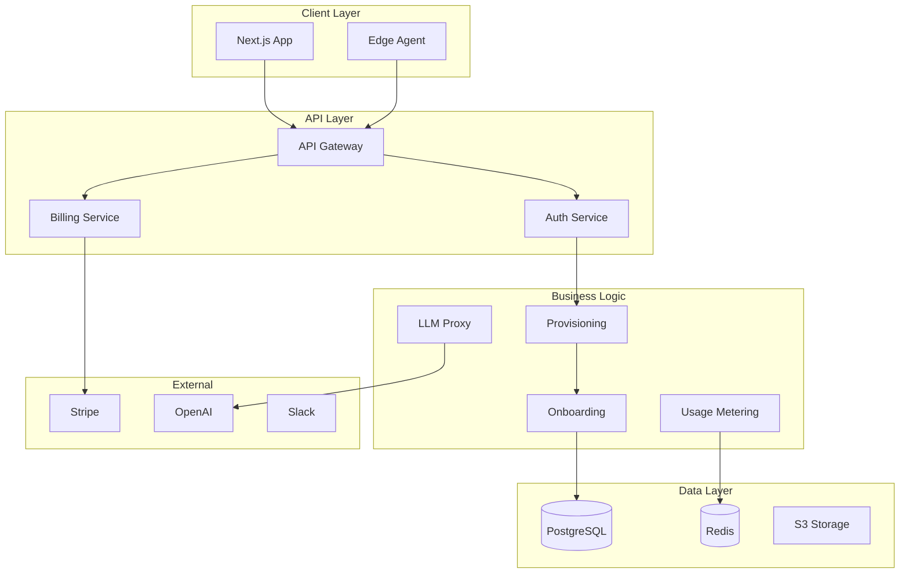

# Product Requirements Document (PRD)
## Antevus 90-Day Pilot + Monthly Subscription Onboarding

### Version 1.0.0 | September 2025

---

## Executive Summary

This PRD defines the requirements for implementing Antevus's hybrid commercial model: a **$25,000 90-day pilot program** combined with **tiered monthly subscriptions**. The solution enables enterprise customers to validate ROI through a comprehensive pilot while maintaining recurring revenue through subscriptions.

**Key Differentiator**: All AI/LLM capabilities are platform-managed through a secure server-side proxy, eliminating customer API key management and ensuring enterprise security compliance.

---

## Problem Statement

### Current Market Challenges

1. **Long Sales Cycles**: Enterprise lab software deals take 6-12 months
2. **High Commitment Barrier**: $250k+ annual contracts before proving value
3. **Complex Security Requirements**: Labs cannot share LLM API keys
4. **Integration Uncertainty**: Unknown instrument compatibility
5. **Budget Constraints**: CapEx approval harder than OpEx

### Customer Pain Points

- **Scientists**: Need immediate access to try the platform
- **IT Teams**: Require security validation before commitment
- **Finance**: Want demonstrated ROI before large investment
- **Compliance**: Need audit trails and validation period

### Business Impact

- **Lost Deals**: 40% of opportunities stall at contract negotiation
- **Slow Growth**: 9-month average sales cycle
- **High CAC**: $50k+ cost to acquire enterprise customers
- **Churn Risk**: 30% of customers underutilize platform

---

## Goals & Objectives

### Business Goals

1. **Reduce Time-to-Revenue**: First payment within 7 days (vs 6 months)
2. **Increase Conversion**: 60% pilot-to-subscription conversion rate
3. **Improve CAC Efficiency**: 3:1 LTV/CAC ratio within 18 months
4. **Accelerate Adoption**: 5 active users within first week

### Product Goals

1. **Frictionless Onboarding**: <30 minutes to first value
2. **Self-Serve Capable**: 80% complete without support
3. **Platform-Managed AI**: Zero customer API key requirements
4. **Clear Value Demonstration**: Measurable KPIs within 7 days

### Success Metrics

| Metric | Target | Measurement |
|--------|--------|-------------|
| Onboarding Completion | >80% | Wizard completion rate |
| Time to First Value | <24 hours | First successful workflow |
| Weekly Active Users | ≥5 | Unique logins per week |
| Pilot Conversion | >60% | Pilots converting to paid |
| NPS Score | >50 | Post-pilot survey |

---

## User Stories

### Persona: Lab IT Administrator

**Story 1**: Edge Agent Installation
> As an IT admin, I want to install the Edge Agent without opening firewall ports, so that I can maintain security compliance.

**Acceptance Criteria**:
- Download signed installer for Windows/Mac/Linux
- Generate time-limited join token
- Agent connects outbound only (no inbound ports)
- Automatic updates with rollback capability
- Service runs with minimal privileges

**Story 2**: API Key Management
> As an IT admin, I want to manage organization API keys securely, so that I can control access and maintain audit trails.

**Acceptance Criteria**:
- One-time reveal of API keys
- Rotation with zero downtime
- Scoped permissions (agent vs webhooks vs data)
- IP allowlisting option
- Complete audit log

### Persona: Scientist/Researcher

**Story 3**: Natural Language Queries
> As a scientist, I want to ask questions about my experiments in plain English, so that I can get insights without learning query languages.

**Acceptance Criteria**:
- Chat interface with streaming responses
- No API key configuration required
- Context-aware suggestions
- Export results to CSV/PDF
- Privacy-preserved queries (no PHI in logs)

**Story 4**: Workflow Automation
> As a scientist, I want to automate repetitive workflows, so that I can focus on analysis rather than data transfer.

**Acceptance Criteria**:
- Visual workflow builder
- Pre-built templates
- Dry-run preview before execution
- Email/Slack notifications
- Audit trail of all executions

### Persona: Lab Manager

**Story 5**: Usage Monitoring
> As a lab manager, I want to track platform usage and costs, so that I can stay within budget and demonstrate ROI.

**Acceptance Criteria**:
- Real-time usage dashboard
- Cost forecasting
- Alert at 80% and 95% thresholds
- Export reports for finance
- Per-project cost allocation

**Story 6**: Team Management
> As a lab manager, I want to invite team members with appropriate permissions, so that everyone can access what they need.

**Acceptance Criteria**:
- Email invitation flow
- Role-based permissions (Admin/User/Viewer)
- SSO integration option
- Bulk user import
- Access audit reports

### Persona: Compliance Officer

**Story 7**: Audit Compliance
> As a compliance officer, I want comprehensive audit logs, so that we can meet FDA 21 CFR Part 11 requirements.

**Acceptance Criteria**:
- Immutable audit trail
- User attribution for all actions
- E-signature capability
- WORM storage option
- Automated compliance reports

**Story 8**: Data Security
> As a compliance officer, I want to ensure all data is encrypted and access-controlled, so that we meet HIPAA requirements.

**Acceptance Criteria**:
- Encryption at rest (AES-256)
- Encryption in transit (TLS 1.3)
- No PHI in notifications
- Data retention policies
- Right to deletion support

---

## Functional Requirements

### 1. Payment & Provisioning

**1.1 Stripe Checkout Integration**
- Support credit card and ACH payment
- Automatic tax calculation
- PCI-compliant payment flow
- Subscription management portal
- Usage-based billing for overages

**1.2 Pilot Invoice Generation**
- $25,000 invoice via Stripe Invoicing
- NET-30 payment terms
- Automatic reminder emails
- Invoice status tracking
- In-app payment status banner

**1.3 Instant Provisioning**
- Organization creation on checkout completion
- Workspace setup with default configuration
- API key generation
- Usage credit allocation
- Simulated instrument seeding

### 2. Onboarding Wizard

**2.1 Profile Setup**
- Role selection (Scientist/IT/Manager/Compliance)
- Contact information
- Timezone configuration
- Notification preferences
- Team size estimation

**2.2 API Configuration**
- Organization API key reveal
- HMAC webhook secret generation
- Endpoint URL configuration
- Test connection validation
- Documentation links

**2.3 Edge Agent Setup**
- Platform-specific installer download
- Join token generation (30-min TTL)
- Installation verification
- Auto-discovery initiation
- Troubleshooting guide

**2.4 Instrument Discovery**
- Network scanning
- Instrument identification
- Metadata collection
- User selection interface
- Safe configuration apply

### 3. Platform-Managed AI

**3.1 Server-Side LLM Proxy**
- All LLM calls through Antevus servers
- No customer API keys accepted
- Automatic model selection
- Rate limiting per organization
- Token usage metering

**3.2 Security Controls**
- Request/response filtering
- PHI/PII redaction
- Audit logging
- Query sanitization
- Result caching

**3.3 Usage Metering**
- Real-time token counting
- Cost calculation
- Budget alerts
- Usage reports
- Overage handling

### 4. Integration Hub

**4.1 No-Code Endpoints**
- Suggested HTTPS endpoints
- HMAC signature validation
- Connection testing
- Error diagnostics
- Retry configuration

**4.2 Third-Party Integrations**
- Slack workspace connection
- Email notification setup
- ELN/LIMS connectors
- Calendar integration
- Webhook management

### 5. Monitoring & Analytics

**5.1 KPI Dashboard**
- Time saved metrics
- Workflow automation count
- Active user tracking
- Integration usage
- Error rates

**5.2 Usage Analytics**
- Real-time event streaming
- AI token consumption
- Storage utilization
- API call volumes
- Cost breakdown

**5.3 Pilot Progress**
- Days remaining counter
- Success criteria tracking
- Weekly report generation
- ROI calculator
- Conversion prompts

---

## Non-Functional Requirements

### Performance

- **Page Load**: <2 seconds for dashboard
- **API Response**: <200ms p95 latency
- **Streaming**: <100ms for chat responses
- **Discovery**: <30 seconds for instrument scan
- **Provisioning**: <5 seconds for workspace creation

### Scalability

- Support 1000+ concurrent organizations
- Handle 10M+ events per day
- Process 100M+ AI tokens per month
- Store 10TB+ of instrument data
- Scale to 50+ instruments per organization

### Security

- **Authentication**: OAuth2/JWT with MFA option
- **Authorization**: RBAC with org isolation
- **Encryption**: AES-256 at rest, TLS 1.3 in transit
- **Secrets**: Vault-based management
- **Compliance**: SOC 2, HIPAA, FDA 21 CFR Part 11 ready

### Reliability

- **Uptime**: 99.9% SLA for Scale tier
- **Backup**: Daily automated backups
- **Recovery**: <4 hour RTO, <1 hour RPO
- **Redundancy**: Multi-region deployment
- **Monitoring**: Real-time alerting

### Usability

- **Accessibility**: WCAG 2.1 AA compliance
- **Browser Support**: Chrome, Firefox, Safari, Edge (latest 2 versions)
- **Mobile**: Responsive design for tablets
- **Localization**: English with i18n framework
- **Documentation**: Inline help + video tutorials

---

## Technical Architecture

### System Components



### Data Model

```sql
-- Organizations
CREATE TABLE organizations (
  id UUID PRIMARY KEY,
  name VARCHAR(255) NOT NULL,
  stripe_customer_id VARCHAR(255),
  subscription_tier ENUM('core', 'team', 'scale', 'enterprise'),
  pilot_active BOOLEAN DEFAULT false,
  pilot_start_date TIMESTAMP,
  pilot_end_date TIMESTAMP,
  created_at TIMESTAMP DEFAULT NOW(),
  updated_at TIMESTAMP DEFAULT NOW()
);

-- API Keys
CREATE TABLE api_keys (
  id UUID PRIMARY KEY,
  org_id UUID REFERENCES organizations(id),
  key_hash VARCHAR(255) NOT NULL,
  name VARCHAR(255),
  scopes JSONB, -- ['agent', 'webhooks', 'data']
  last_used_at TIMESTAMP,
  expires_at TIMESTAMP,
  created_by UUID REFERENCES users(id),
  created_at TIMESTAMP DEFAULT NOW()
);

-- Usage Metrics
CREATE TABLE usage_metrics (
  id UUID PRIMARY KEY,
  org_id UUID REFERENCES organizations(id),
  metric_type ENUM('events', 'ai_tokens', 'storage'),
  value BIGINT NOT NULL,
  cost DECIMAL(10,4),
  period_start TIMESTAMP,
  period_end TIMESTAMP,
  created_at TIMESTAMP DEFAULT NOW()
);

-- Onboarding Progress
CREATE TABLE onboarding_progress (
  id UUID PRIMARY KEY,
  org_id UUID REFERENCES organizations(id),
  step VARCHAR(50),
  completed BOOLEAN DEFAULT false,
  completed_at TIMESTAMP,
  metadata JSONB,
  created_at TIMESTAMP DEFAULT NOW()
);
```

---

## Implementation Plan

### Phase 1: Foundation (Week 1-2)

**Sprint 1 Goals**:
- Stripe Checkout integration
- Basic provisioning flow
- Organization/workspace creation
- API key generation
- Database schema implementation

**Deliverables**:
- `/signup` page with Stripe Checkout
- Provisioning webhook handler
- Organization dashboard shell
- API key management UI
- Initial database migrations

### Phase 2: Onboarding (Week 3-4)

**Sprint 2 Goals**:
- Onboarding wizard implementation
- Edge Agent installer packaging
- Join token system
- Instrument discovery UI
- Integration templates

**Deliverables**:
- Multi-step onboarding wizard
- Signed installers for all platforms
- Discovery and attachment flow
- No-code endpoint configuration
- Help documentation

### Phase 3: AI & Metering (Week 5-6)

**Sprint 3 Goals**:
- LLM proxy service
- Usage metering system
- Billing dashboard
- Alert notifications
- Compliance features

**Deliverables**:
- Server-side LLM proxy
- Real-time usage tracking
- Cost forecasting UI
- Email/Slack alerts
- Audit log viewer

### Phase 4: Polish & Launch (Week 7-8)

**Sprint 4 Goals**:
- Performance optimization
- Security hardening
- Documentation completion
- Beta testing
- Launch preparation

**Deliverables**:
- Load testing results
- Security audit report
- User documentation
- Training videos
- Launch plan

---

## Risks & Mitigations

### Technical Risks

| Risk | Impact | Probability | Mitigation |
|------|--------|-------------|------------|
| Stripe webhook failures | High | Low | Retry logic, manual reconciliation |
| LLM rate limits | Medium | Medium | Multiple provider fallback |
| Instrument compatibility | High | Medium | Simulation mode, phased rollout |
| Usage metering accuracy | High | Low | Audit trails, reconciliation jobs |

### Business Risks

| Risk | Impact | Probability | Mitigation |
|------|--------|-------------|------------|
| Low pilot conversion | High | Medium | Success manager, weekly reviews |
| Complex onboarding | Medium | Medium | Wizard, templates, white-glove option |
| Security concerns | High | Low | Platform-managed AI, compliance certs |
| Budget overruns | Medium | Low | Usage alerts, spending caps |

---

## Success Criteria

### Launch Criteria
- [ ] 100% of user stories implemented
- [ ] <2% error rate in production
- [ ] 90% code coverage
- [ ] Security audit passed
- [ ] Documentation complete

### Pilot Success Criteria
- [ ] ≥30% manual time reduction
- [ ] ≥3 workflows automated
- [ ] ≥5 active users per week
- [ ] ≥2 integrations live
- [ ] NPS score ≥50

### Business Success Criteria
- [ ] 60% pilot conversion rate
- [ ] <30 min average onboarding
- [ ] <24 hour time to value
- [ ] 3:1 LTV/CAC ratio
- [ ] <5% monthly churn

---

## Appendices

### A. Competitor Analysis

| Feature | Antevus | Competitor A | Competitor B |
|---------|---------|--------------|--------------|
| Pilot Program | ✅ $25k/90 days | ❌ Annual only | ⚠️ 30-day trial |
| Platform AI | ✅ Managed | ❌ BYO keys | ❌ No AI |
| No-Code Setup | ✅ Full wizard | ⚠️ Partial | ❌ Technical |
| Compliance | ✅ FDA/HIPAA | ⚠️ HIPAA only | ❌ None |
| Pricing Model | ✅ Hybrid | ❌ Annual | ✌️ Monthly |

### B. Glossary

- **Edge Agent**: Software installed on customer premises to connect instruments
- **Join Token**: Time-limited code to authenticate agent to workspace
- **HMAC**: Hash-based Message Authentication Code for webhook security
- **LLM Proxy**: Server-side service that handles all AI operations
- **Usage Metering**: System for tracking and billing resource consumption

### C. References

- [Stripe Checkout Documentation](https://stripe.com/docs/checkout)
- [FDA 21 CFR Part 11](https://www.fda.gov/regulatory-information)
- [HIPAA Compliance Guide](https://www.hhs.gov/hipaa)
- [SOC 2 Requirements](https://www.aicpa.org/soc)

---

*Document Version: 1.0.0*
*Last Updated: September 18, 2025*
*Status: APPROVED*
*Owner: Product Team*